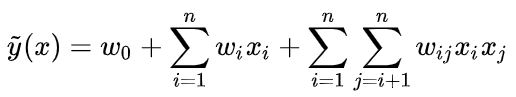

# Research-Paper-Note
My research paper notes, focusing on data mining/recommender/reinforcement learning. This README.md file is a total collection of all papers in chronological order (key words provided for indexing). There are subcatalog markdown files available for area-specific indexing.

我的论文笔记，主要聚焦于数据挖掘、推荐系统、强化学习。这里是所有论文笔记的汇总，按照时间顺序排列（提供了关键词方便检索），同时可以去具体的分类markdown文档中检索论文。

## Click Models for Web Search

链接：[Survey: Click Models for Web Search](https://www.semanticscholar.org/paper/Click-Models-for-Web-Search-Authors-%E2%80%99-version-*-Chuklin-Markov/0b19b37da5e438e6355418c726469f6a00473dc3?p2df)

关键词：Click Model, CM, Probabilistic Graphical Models, PGM

这篇15年的综述对PGM时代（前深度学习时代）的Click Models进行了完整的总结，基本之后我们做Click Model的文章必然会引用，好文推荐。

## A Neural Click Model for Web Search

链接：[https://dl.acm.org/doi/10.1145/2872427.2883033](https://dl.acm.org/doi/10.1145/2872427.2883033)

关键词：NCM, Click Model, LSTM, User Modeling

以前的click model都是基于概率图模型的，这篇WWW16的文章第一次用神经网络和深度学习去建模click model任务，算是开创性的工作。模型本身十分简单，就是用一个RNN去表示一个doc list的sequence process。文章中没有给出实现代码，我自己成功复现了一版代码[[Link](https://github.com/CHIANGEL/Neural-Click-Model)]，需要注意，我的复现版本和原论文有几点不一样的地方（个人认为是改进）：

- 我没有采用原论文中one-hot的embedding方法，而是直接用PyTorch的nn.embedding对每一个id进行feature初始化，然后让embedding参与梯度更新。原论文的one-hot方法非常笨重，一个embedding可以长达10240维，不仅稀疏，而且很难放入GPU加速。
- 我额外加入了vertical type信息，这个取决于我们采用的数据集有没有这些额外信息。
- 我在每一个RNN的time step都输入了query信息，而不只是用query信息去做初始化，防止query信息被遗忘。

## A Context-Aware Click Model for Web Search

链接：[https://dl.acm.org/doi/10.1145/3336191.3371819](https://dl.acm.org/doi/10.1145/3336191.3371819)

关键词：CACM, Click Model, User Modeling

对Click Model任务进行更加复杂的建模，参考PGM时代Click Model的Examination Hypothesis，CACM将Click Probability分成Examination Prediction和Relevance Estimation两部分建模，然后通过一个Combination Layer进行结合计算出每一个doc的点击概率。可以理解为是通过堆积复杂模型来达到更好的性能，个人感觉没有NCM优雅和灵活。

最重要的是，我认为CACM中的Relevance Estimator的建模是存在一定的问题的，从下图看，Relevance Estimator的Click Context Encoder中已经将document的序列信息也建模进来！但是常识中，query-doc的相关性分数relevance score应该是一个和doc位置信息无关的东西，CACM的建模方式却意味着，**一模一样的query-doc pair，一旦doc的位置发生改变，这个query-doc pair的relevance score也就会发生改变**，这是一件不合理的事情。

## An End-to-End Neighborhood-based Interaction Model for Knowledge-enhanced Recommendation

链接：[https://arxiv.org/abs/1908.04032](https://arxiv.org/abs/1908.04032)

关键词：NI, KNI, Graph, Recommender, KDD Workshop Best Paper

本文主要解决三个问题：

- Data Sparsity
- Cold Start
- Early Summarization

前两个是RecSys中常见的问题，一般GNN的方法都可以缓解，第三个问题则是本文提出的一个新概念，意思是寻常GNN的方法是直接利用目标结点的邻居去生成embedding，这样并没有充分的利用图结构的local structure（比如邻居与邻居之间的交互），因此这个embedding是被“过早”的生成了，缺失了一部分有价值的local信息。

接着，文章以Average Aggregation和Attention Aggregation为例，总结了目前GNN的一种通式：

其中矩阵A是一个系数矩阵，侧重于local structure；矩阵Z则是一对目标结点u，v的邻居的两两组合的内积矩阵，侧重于全局信息。而之前提到的Average Aggregation和Attention Aggregation，其实就是这个通式的特例，即改变矩阵A。因此我们也可以进一步对A进行改进，加入“邻居和邻居”之间的互动关系，从而得到NI模型的公式：

其实相对于Attention Aggregation，NI的不同就在于拼接了更多的结点信息，从而更好地利用邻居信息，一定程度上解决Early Summarization的问题。

上面的讨论还是仅限于User-Item的图结构，如果我们通过引入知识图谱的信息，即更多的Entity和Relation，就可以构建KNI。相比于NI，KNI的区别就是图结构更加丰富，公式和计算过程没有改变。除此之外，KNI和NI都运用了Neighbor Sampling的技术。而也正是因为采用了NS技术，KNI/NI在Evaluation阶段会有一个类似assemble的过程，eval次数越多，sample次数越多，性能会有进一步的提升。因此，文章是每次进行40次eval，然后取平均。

## User Behavior Retrieval for Click-Through Rate Prediction

链接：[https://arxiv.org/abs/2005.14171](https://arxiv.org/abs/2005.14171)

关键词：UBR4CTR, User Behavior Retrieval

CTR预测一般会用到用户的历史信息来产生personalized的预测结果，比如DIN、DIEN都是这方面经典的工作。但是如果用户的历史信息序列过长，我们不可能把该用户所有的历史信息都一股脑放入模型进行预测，这样还带来两方面的坏处：

- 运算时间过长
- 过长的历史信息序列会包含很多的无用信息和噪声，反而不利于预测

因此，目前学界、工业界常用的操作就是直接做一个截断，只把该用户最近的历史信息序列截取过来做CTR预测，这样的操作简单，但是可能会遗漏有价值的信息，比如用户的长期、周期性的行为规律。因此如果从用户特长的历史信息序列中筛选出有价值、低噪声的历史信息用于CTR预测是很重要的，本文就提出了一种基于Attention的用户历史信息筛选机制，来取代目前“简单截断历史信息序列”的粗暴方法。

这其实是一种很简单但很重要的思想，即应该筛选用户的历史信息而不是简单截断。至于这个“筛选”的方法，就可以千变万化，这篇文章中提到的只是一种可能的筛选机制，比如在工业界部署上，为了简化，我们可以通过制定规则来实现筛选，比如和target item属于同一类别的item历史信息应当被重点考虑。

## Graph Attention Networks

链接：[https://arxiv.org/abs/1710.10903](https://arxiv.org/abs/1710.10903)

关键词：Attention, GAT, Graph

ICLR2018的工作，比GraphSage迟一年。GAT将Attention机制引入图神经网络，但和GraphSage类似，还是每次通过将目标结点的一阶邻居想自己汇总信息，来得到最新的node embedding，只不过这个“汇聚”过程不再是简单取平均，而是通过attention机制的加权平均，而attention系数则是有一个**全结点共享**的线性变化层求得：

公式中，LeakyReLU及其里面的a就是那个全节点共享的线性变化层，input是目标结点i和他的一个一阶邻居j的embedding。LeakyReLU外面套的就是一个softmax，即可得到目标结点i的所有一阶邻居j的attention系数（i也算自己的一阶邻居，即添加自环self-loop）。另外，值得注意的是，上面这个attention系数计算公式是对两个节点i,j对称的，因此其实就是图中每条边可以计算出一个attention系数。接着通过对所有一阶邻居的加权得到目标结点i的新embedding：

同时，文章还提出留用multi-head attention来稳定GAT的学习过程，也就是简单的独立的计算多组GAT，然后通过取平均或者拼接的方式进行集成。

## Inductive Representation Learning on Large Graphs

链接：[https://arxiv.org/abs/1706.02216](https://arxiv.org/abs/1706.02216)

关键词：GNN, GraphSage

GraphSage应该是第一个提出图神经网络中inductive和transductive区别的工作（不太确定），transductive是指test set中的节点必须在training set中出现过（只是没有标签），而inductive则是指test set中的节点不一定出现在training set中，也就是在测试阶段允许出现全新的节点，那么难点就在于这些出现的全新节点其实并没有一个很好的embedding（因为没有参与训练），所以inductive比transductive更具备挑战性，也更贴近实际应用场景。

GraphSage通过对目标结点的邻居信息进行聚合操作，来生成目标节点的embedding（可以给目标节点添加自环，使之也考虑自身信息），所以GraphSage主要分为两步，首先是对目标节点的周围邻居进行聚合aggregation，得到一个新的embedding，然后将这个新embedding和目标节点原本的embedding进行拼接、过一个全连接层，最终得到目标节点的output embedding。

上述是GraphSage的通识，然后有三点可以变通和思考的地方：

- 聚合aggregation有多种不同的函数可以选择，比如简单取平均、pooling、LSTM等等，本质上就是把多个input vector信息融合成一个vector
- 一次aggregation没必要把目标节点的所有邻居都拿来算，我们可以采用Neighbor Sampling的技术，每次只从目标节点的邻居集合中采样出K个即可（集合大小不足K，那就有放回的采样），这样既可以使得计算时的数据维度对齐，方便GPU加速，同时也是一种assemble方法。
- 对目标节点，我们可以多次aggregation，每一次聚合，就是向外扩展一层邻居，如此就可以聚合高阶邻居的信息

## Heterogeneous Graph Attention Network

链接：[https://arxiv.org/abs/1903.07293](https://arxiv.org/abs/1903.07293)

关键词：HGAT, HAN, Heterogeneous

原论文给这个模型起名缩写是HAN，但因为该模型可以理解为是GAT在异质图上的扩展，因此有不少人称之为HGAT。本文的attention机制可以分类两层，第一层是node-level attention，第二层是semantic-level attention（其实就是meta-path-level attention），但这里的attention系数是用MLP或者向量内积算出来的。

文章首先给出了一系列的定义，包括meta-path、meta-path based neighbor之类的，详见原文。假设数据集有N个节点，人为定义P类meta-path，对每一个结点i，我们通过node-level attention的到了结点i的P个embedding，此时一共N*P个embedding。

接着，在semantic-level attention阶段，我们要转换思维。在此之前，这N*P个embedding我们会潜意识中将它们分为N类（即按照结点分），接下来我们要按照meta-path将这些embedding分为P类，然后通过semantic-level attention计算出P个attention系数，然后将P类合成一类，得到最终的N个embedding。注意，下图中的取平均，就是对每一类meta-path的N个embedding算出的coefficient求平均，因为当时看论文的时候困惑了一下，所以这里我特意讲到“转换分类思维”的想法。

## TGCN: Tag Graph Convolutional Network for Tag-Aware Recommendation

链接：[https://dl.acm.org/doi/10.1145/3340531.3411927](https://dl.acm.org/doi/10.1145/3340531.3411927)

关键词：Tag-Aware, TGCN, Graph, TRS

TRS (Tag-Aware Recommender)，即user在和item产生交互的同时，会主动给item打上一些标签tag，那么这些tag不仅会反映item的属性，还会反映user的潜在兴趣，是可以利用的side information。本文提出了三点motivation（其实和其他用图做推荐的都大同小异）：

- Cold Start，老生常谈的问题，GNN论文必备motivation
- Ambiguity，tag一般是用字符串表示，而一样的tag对不同的item和user会有不同的含义，比如apple可以是水果，也可以是手机
- Redundancy，和ambiguity对应，不同的tag可能表示一样的含义，比如mobile phone和ceil phone

本质上Ambiguity和Redundancy都是因为单纯的tag缺乏上下文和语义信息，如果引入图，tag节点的邻居就可以提供辨别信息，解决这些问题。

首先是构图，文章的构图方法很简单，一次user和item的交互会产生若干三元组(user, item, tag)，对每一个三元组，我们就分别将user、item、tag彼此连边，同时user-item边权重为1，user-tag和item-tag的权重取决于这个tag在user/item邻居中出现的次数，也就是说，tag出的次数越多，说明这个tag对user/item越重要。

TGCN比较特别的地方在于它做了两层aggregation（node-level和type-level，HGAT/HAN有异曲同工之妙）。对于一个中心节点，在node-level aggregation中，我们先对它的邻居按类型进行分别sample和attention，在本文中，也就是三类邻居节点，分别求出三个embedding用以表示中心节点的邻居信息，然后在通过type-level aggregator进行邻居之间的信息整合。

显而易见，我们在type-level aggregation也可以简单地采用attention机制，但是TGCN认为我们应该将特征交叉的思想拿进来，所以TGCN没有把所有的node-level邻居向量用attention合成一个，而是拼成一个2D矩阵（类似于图片），然后参考CV中的卷积层，提出了横向/纵向两类卷积特征交叉方法，具体可以看论文。

type-level aggregation结束后我们就得到了user和item的embedding，最后一个简单的内积就可以求得user-item的CTR。

除此之外，TGCN还提出了TransTag，其实就是在端到端训练的loss function中加入一项。具体来说，就是参考了TransE的思路，认为tag是连接user和item的一类特殊边，所以在embedding层面上，user + tag应该和item尽量接近。这一点的提出也有很形象的可解释性，user1和user2都和item1发生了交互，但他们发生交互的原因可能是不一样的，比如user1是因为价格低，user2是因为好看，而这样的区别就是由tag提供的。

## Hypergraph Convolution and Hypergraph Attention

链接：[https://arxiv.org/abs/1901.08150](https://arxiv.org/abs/1901.08150)

关键词：Hypergraph, Attention, HyperConv, HyperAtten

超图（HyperGraph）是这样的：若图中的一条边可以连接两个甚至更多的节点，那么这样的边被称为超边（HyperEdge）；由超边构成的图即为超图。比如推荐系统中，user和一个带有tag属性的item产生了交互，则我们可以认为user-item-tag是一条超边。普通的图的定义是超图的子集，因此超图本身就带有更多的信息，值得被挖掘。

我们会用一个incidence matrix H去表示超图的边集合，假设超图中有N个节点，M个超边，则矩阵H的大小即为N×M，每一列代表一条超边，若一个节点在被该超边所连接，则矩阵元素记为1，否则记为0。同时会有一个形状为M×M的对角矩阵，存放每一个超边的权重（一般我们可以全部设为1）。

本文中的超图卷积（Hypergraph Convolution）算子是基于两个假设：

- 一条超边所连接的节点们应该有更多的信息传播
- 一条超边的权重越高，它的信息传播越重要

由此，我们可以定义单步的超图卷积算子以及其矩阵形式：

因为上述公式中的HWH^T的谱没有约束，这可能导致梯度爆炸或者梯度消失，因此需要加入归一化项：

之后，文章还提出了一种超图上的learnable attention结构（超图卷积本身就是一种attention，但不是learnable的），但是做了一个强假设：节点和超边是处于同一个向量空间，因此我们可以去比较节点和超边之间的相似性。最后，文章还证明了传统图卷积是超图卷积的一个特例。

但这种hypergraph的方法有一个缺点在于，这个incidence matrix H限制了超图的大小，如果超图的超边数量上去了，很可能就会爆内存，不容易实现。

## metapath2vec: Scalable Representation Learning for Heterogeneous Networks

链接：[https://dl.acm.org/doi/10.1145/3097983.3098036](https://dl.acm.org/doi/10.1145/3097983.3098036)

关键词：metapath2vec, Heterogeneous Graph, Graph Embedding, Representation Learning

这是一篇关于graph embedding的工作，一般不会作为一个GNN模块插入Embedding层和Prediction层之间（比如GAT/GCN/GraphSage）。本文其实就是Deepwalk/node2vec系列方法在异质图上的改版，通过metapath游走来得到一系列的节点上下文，然后再用Word2Vec中的skip-gram模型进行表示学习。

首先是如何基于metapath进行随机游走：

简而言之，随机游走的路径必须符合metapath指定的节点顺序，如果当前节点的邻居有多个节点符合metapath的要求，则是一个均匀概率的随机游走，没有node2vec中对游走概率的控制。

通过随机游走得到了一系列的节点上下文，接着我们就可以利用skip-gram模型进行embedding learning。在这一步中，论文提出了两种算法：metapath2vec和metapath2vec++，二者在随机游走阶段的算法是一致的，只是在skip-gram时有些微不同。metapath2vec的softmax是在所有节点上进行归一化（不区分节点类型），而metapath2vec++则是区分节点类型，softmax是在同类节点上进行归一化。最后，和skip-gram一样，我们通过负采样来优化加速。

这篇文章很经典，但是我认为有以下两点不足：

- 虽然说是考虑异质图，但是却假设不同类型节点的embedding存在于同一个隐向量空间，这样可能会损失部分信息（对比Trans系列的工作）
- 最致命的缺点在于，原文算法和实现算法都仅支持利用一条metapath去进行随机游走，但是在一个复杂异质图上，必然存在多种有价值的metapath。
- 更进一步，如果我们用多条metapath去随机游走采样，那如果平衡不同metapath采样出来的节点上下文数量和重要性又会成为一个新的问题，因此不能简单地把metapath2vec从单条metapath扩展到多条metapath，这也成了该算法最致命的局限性。

## Representation Learning on Graphs with Jumping Knowledge Networks

链接：[https://arxiv.org/abs/1806.03536](https://arxiv.org/abs/1806.03536)

关键词：Graph, Representation Learning, Deeper, JK-Nets

本文的motivation是想要解决传统GCN中oversmoothing和less-information的问题。众所周知，传统的GCN不能太深，一般2层就是最优了。

参考上图，我们有以下分析结论：

- a处于dense core中，四步更新基本可以拿到整个graph所有节点的信息，进而引发over-smooth的问题：节点聚集更多更广的邻居信息，则表达更global/更平滑，导致很多节点的表达基本一致而没有区分性。
- b处于边缘，即使是四步更新，能拿到的邻居信息也是寥寥无几，和a产生鲜明对比，这个问题我们称之为less-information
- 对比b和c，只是在多加了一层（4步更新和5步更新），处于边缘的节点能拿到的节点信息就忽然倍增，甚至可能引发over-smooth的问题

综上，我们很难把握合适的GCN层数，不同的节点、不同的层数都可能导致邻居信息的天差地别，因此导致“传统GCN不能太深”的问题。而这个问题的本质在于：**有的节点需要更多的local信息，有的节点需要更多的global信息，需求不同，但是传统GCN的neighbor aggregation往往是一致对待**。由此，本文提出了layer aggregation的解决方案。

layer aggregation其实就是让模型自己去决定每一个节点需要什么，上图的4层GCN，底层GCN的local信息更多，高层GCN的global信息更多，而这四层的信息会一起通过顶层的layer aggregation，计算得到最终的embedding，也就是通过layer aggregation去平衡local和global的信息。

上图中，纵向是neighbor aggregation，横向是layer aggregation，两种aggregation都可以多种选择，比如Average、Concat、Pooling、LSTM等。而模型之所以取名为Jumping Knowledge，是因为所有GCN层的信息，都jump到了layer aggregation层，因此得名。

## Modeling Relational Data with Graph Convolutional Networks

链接：[https://arxiv.org/abs/1703.06103](https://arxiv.org/abs/1703.06103)

关键词：Graph, RGCN

RGCN就是根据不同类型的边进行分类聚合，核心公式就是下面这一条：

对每一类型的边，有一个转换矩阵theta，对一个目标节点，它的所有邻居根据连边类型进行分别聚合，而各自类的邻居之间去简单平均。文章说RGCN可能会面临过拟合的问题，因为按照连边类型进行分别聚合需要用到多个转换矩阵，当边的类型数量很多的时候（尤其是在知识图谱这种边类型巨多的场景下），RGCN会有过多的模型参数，会带来过拟合问题。因此文章还提出了两种Regularization方法。

第一种被称为basis-decomposition，所有边类型的转换矩阵都是由同一组原始矩阵的线性组合得到的：

其中，这一组原始矩阵的数量也是一个超参数。本质上，这利用了参数共享的思路，每一个边类型所需要拟合的模型参数就大幅下降了。

第二种被称为block-diagonal-decomposition，即每一个边类型的转换矩阵是由一系列的低维矩阵拼成的对角矩阵：

不同于第一种的参数共享思路，这是从稀疏矩阵的思路出发，也不错。但实验表明，具体要不要用regularization方法、哪种regularization好，都是具体任务具体分析。

## Factorization Machines

链接：[https://link.zhihu.com/?target=https%3A//www.csie.ntu.edu.tw/~b97053/paper/Rendle2010FM.pdf](https://link.zhihu.com/?target=https%3A//www.csie.ntu.edu.tw/~b97053/paper/Rendle2010FM.pdf)

关键词：FM

普通的LR线性模型，我们只是将各个特征独立考虑，并没有考虑到特征与特征之间的互相关联，严重的可能会导致[辛普森悖论](https://zh.wikipedia.org/wiki/%E8%BE%9B%E6%99%AE%E6%A3%AE%E6%82%96%E8%AE%BA)。因此在CTR预估中考虑特征交互是非常重要的，以常见的二阶交叉为例，下面是通用的二阶交叉公式：

第一项是偏置项，第二项是一阶特征（没有交互），第三项是二阶特征交互，两两特征之间的交互被赋予一个权重w。但是这样的二阶交互复杂度极高，是O(N^2)。而FM的改进就是针对这个二阶交叉权重提出的，对每个特征，FM额外训练一个隐向量v，则两个特征交互的权重就由对应的两个隐向量点乘得到，即：

FM大幅度降低了二阶交叉的复杂度，从O(N^2)降到了O(NK)，模型需要估计的参数是：

除此之外，FM还解决数据稀疏性的问题，提高模型泛化能力。因为隐向量的存在，即使训练数据中没有特征值x与特征值y的交互出现，我们仍然能够在测试阶段预估特征值x与特征值y的交叉情况。缺点上，由于组合爆炸的问题限制，FM模型不易扩展到三阶特征交叉。

## Field-aware Factorization Machines for CTR Prediction

链接：[https://www.csie.ntu.edu.tw/~cjlin/papers/ffm.pdf](https://www.csie.ntu.edu.tw/~cjlin/papers/ffm.pdf)

关键词：FFM

FFM在FM的基础上提出了域（Field）的概念。首先我们需要明确，特征就是指某一个特征值，比如男性是一个特征，女性、中国、美国、日本、耐克、阿迪达斯都是一个一个的特征。而域可以理解为是对一系列特征的一种归纳划分，比如男性、女性属于“性别”这个域，中国、美国、日本属于“国家”这个域，耐克、阿迪达斯属于“运动品牌”这个域。

假设我们一共有n个特征，对这些特征划分出f个域。在FM中，我们对每一个特征都训练一个隐向量，共需要n个隐向量。而在FFM中，我们对每个特征都会训练f个隐向量，分别对应f个域，一共需要n*f个隐向量。当特征x和特征y做交互的时候，特征x会根据y所在的域挑选出自己隐向量组（一组一共f个隐向量）中对应的向量，特征y同理，然后两个挑选出来的隐向量内积得到特征交互的权重。本质上，FM就是只有一个域的FFM。

缺点上，FFM因为引入了特征域的概念，计算复杂度从O(NK)上升到了O(KN^2)，训练开销大。

## An Adversarial Imitation Click Model for Information Retrieval

链接：[https://chiangel.github.io/files/publication/An_Adversarial_Imitation_Click_Model_for_Information_Retrieval.pdf](https://chiangel.github.io/files/publication/An_Adversarial_Imitation_Click_Model_for_Information_Retrieval.pdf)

关键词：AICM, Click Model, User Modeling, Imitation Learning, GAIL

这是一篇用模仿学习+深度学习去做Click Model任务的文章，是模仿学习中的GAIL框架，也就是对抗训练的过程。AICM重新审视了Click Model这个task，认为Click Model对用户行为的建模过程本质上是一种行为模式（Policy）的模仿，因此可以把User Click Log认为模仿学习中的专家数据，那么Click Model任务就很自然的变成了一种对专家数据的模仿学习过程。

整体结构上，AICM遵循GAIL框架，设置了一个Generator和一个Discriminator。Generator本质就是一个Click Model（Policy），在给出一个Doc List后，Generator会产生一系列的点击信息，组成和User Click Log数据格式一致的生成数据。Discriminator则是一个打分器，用于鉴别输入的User Click Log数据是real data还是generated data。而Gnerator（即Click Model）的Objective就是由Discriminator的输出得到。具体结构上，Generator（即Click Model）和Discriminator均采用了和NCM一致的GRU结构。

除了结构上的创新，AICM还提出了一个针对Click Model的新评价指标：Reverse PPL和Forward PPL。在此之前，Click Model的Evaluation主用采用Log-likelihood (LL)、Perplexity (PPL)和NDCG，这些指标其实只是将Click Model视为一种预测模型（Predictive Model），但Click Model是需要为下游任务提供点击信息的指导，所以更应该被视为一种生成模型（Generative Model），因此我们需要对训练得到的Click Model的泛化性能进行评估，即衡量Click Model生成的数据的概率分布，与真实数据的概率分布之间的差异程度。基于此，AICM提出了Reverse PPL和Forward PPL评价指标。

很显然，我们的目标是比较生成数据和真实数据内在概率分布的差异程度，可行的思路是我们使用一个中间代理模型Surrogate Model（是另一个Click Model），让代理模型在生成数据上进行训练，在真实数据上进行测试；或者让代理模型在真实数据上进行训练，在生成数据上进行测试；测试结果越好，就说明生成数据和真实数据的一致程度越高，生成数据的Click Model作为Generative Model的泛化性能就越好。而上面提到的代理模型“在生成数据上训练、真实数据上测试”和“在真实数据上训练、生成数据上测试”就分别对应了Reverse PPL和Forward PPL两个新指标。

## Denoising Implicit Feedback for Recommendation

链接：[https://arxiv.org/abs/2006.04153](https://arxiv.org/abs/2006.04153)

关键词：ADT, Denoise, Noise Label, Implicit Feedback, Recommendation

目前关于Learning with Noise Label的工作主要集中在CV领域，Noise Label在Recommender领域的定义本身就比较模糊，甚至很多人会把noise和bias混为一谈，本文可以说是第一篇为推荐领域明确定义了Noise Label的概念（之前也有工作focus在推荐领域的nosie label上）并且提出了无需额外数据即可达成denoise目标的训练方法。

首先我们来定义在推荐系统领域下，什么是Noise Label。在推荐领域，我们往往认为Click即为一种Positive Feedback，但其实很多时候，用户的点击并不能真正代表他的喜好。比如我因为标题党点进了一篇新闻/推送/视频等，但是估计我一进去两三秒就发现不对，直接退出，这样的Click就是一种Noise。再举一个例子，在电商中，用户可能会点击或者购买某一个产品，但是最终却会给出一个较低的评分（rating），这时候的Click我们也认为是一种Noise。综上所述，如果一个Click发生，但是却并不能反映用户的**真实**喜好，那么这个Click就是Noise，在论文中被称为false-positive interaction。而衡量false-positive自然需要一些额外信息，比如用户点进去的停留时间（dwell time）或给出的评分（rating）。

之前也有不少工作是针对这样的Noise Label（即推荐领域中的false-positive interaction），但这些工作往往都需要在训练中加入额外信息（比如停留时间或评分）来指导识别可能的noisy sample，但是如此方法的缺点在于，本身click信息就已经是稀疏的，这些方法要求在click的同时还要具备评分等额外信息，于是就是稀上加稀，难以训练，也不现实。而本文提出的ADT方法，是不需要在训练中加入额外信息，就可以做到denoise的。

从方法上看，ADT其实就是一种sample reweighting的思路。因为noise sample的特点就是难以拟合，所以训练过程中loss偏大的sample更可能是noise sample，则我们应该要降低这些sample的权重，使得网络的更新偏重于那些loss更低、更可能是clean sample的样本。ADT有两种reweighting方法，一种是直接截断，即loss大于某个阈值的sample的loss直接手动归零（阈值会随训练进程而变化，因为整体loss会随着拟合过程下降），。另一种则是给每一个sample加上一个动态的reweighting系数，这个系数是和model预测的[0,1]的click rate有关，预测的点击率越接近0.5，说明model对这个sample的预测越不确定，就越有可能是noise sample，则权重更低。

整体来说，我认为这篇文章的意义在于为推荐系统领域制定了一个较好的setting，也就是如何在不使用额外信息的情况下对implicit feedback进行denoise training，文章提出的ADT中的两种reweighting思路，在CV领域的denoise method中早有人做过，不是新思路。因此，也许之后尝试将更多CV领域的denoise方法迁移到这个setting上会是一个不错的水论文的方向。

## Co-teaching: Robust Training of Deep Neural Networks with Extremely Noisy Labels

链接：[https://arxiv.org/abs/1804.06872](https://arxiv.org/abs/1804.06872)

关键词：Co-teaching, Noise Label, Denoise

本文提出了一种新的训练模式（learning paradigm），基于经典假设：Noise Sample的Loss会比Clean Sample更大，网络可以据此判断哪些更可能是clean sample。Co-teaching同时训练两个网络，每一个mini-batch，两个网络都会根据自己计算的loss挑选出一部分可能的clean sample，然后喂给彼此进行更新。

Co-teaching需要解答的一个问题就在于，为什么网络自己挑出来的clean sample，不给自己做update，而是要喂给别人进行update呢？文章给出的解释是，用自己挑出来的clean sample进行更新，就类似于boosting，会对noise label等异常样本非常敏感。而Co-teaching的方式中，两个网络会学到略有不同的decision boundary，因此可以给彼此纠错。文章举的一个形象例子是，一个学生做题，自查很难发现自己的错误，但如果两个学生互查，就可以找到彼此的错误。但是这个说法其实没有太说服我，用自己调出来的sample做训练，其实就是一种sample reweighting的方法， 把可能是noise sample的直接loss归零，这是存在的方法，只是denoise性能上无从比较。

## Neural Collaborative Filtering

链接：[https://arxiv.org/abs/1708.05031](https://arxiv.org/abs/1708.05031)

关键词：NCF, GMF, NeuMF

NCF是率先将NN引入RecSys/IR领域的文章之一，但是这边文章本身其实略带争议，大概的吃瓜可以知乎问题：[https://www.zhihu.com/question/396722911](https://www.zhihu.com/question/396722911)。本文是在MF的基础上引入了NN来提升性能，作者先指出传统MF的不足：

1. MF中的user隐向量和item隐向量是在同一个向量空间，不太合适
2. MF用到Jaccard Coefficient作为真实的similarity去拟合
3. MF只用一个简单的inner product去衡量两个向量之间的相似程度，这可能会和共现矩阵中的row/column冲突

于是，作者首先提出一个NCF的框架，即用NN来代替innner product来衡量两个向量的similarity。基于这个NCF的框架，作者首先提出了两种基于NCF框架的模型：GMF和MLP。GMF是定制NCF框架中的NN部分，使得这个模型和传统MF干一样的事情，即让user和item的embedding进行element-wise product后在通过一个linear层，但是整体的训练框架遵从NCF。而MLP则是讲user与item拼在一起然后过一个MLP层。可以看到，GMF和MLP其实各占优点，因此作者最后提出了NeuMF模型，结合了上述的GMF和MLP结构。

## Decoupling "when to update" from "how to update"

链接：[https://arxiv.org/abs/1706.02613](https://arxiv.org/abs/1706.02613)

关键词：Decoupling, Noise Label, Denoise

这篇文章的核心思想还是针对所谓的“small loss”进行，即noise sample类似于hard sample，前期loss较大。而神经网络的拟合规律是先拟合简单样本，再拟合困难样本。因此Decoupling提出，应该让神经网络在训练前期拟合batch data中的大部分数据，随着训练的进行，batch中用来拟合的数据也应该越来越少。

基于，Decoupling提出，同时训练两个网络，这两个网络的结构一模一样，唯一的区别来自于不同的参数随机初始化。之后，针对同一个batch data，两个网络会分别进行预测，然后只在它们预测有分歧的样本上进行更新 (disagreement)。因此在训练前期，两个网络是分别随机初始化，所以disagreement大，用于更新的样本多；之后随着训练进行，两个网络朝着相近的optimal方向优化，因此disagreement逐渐减小，从而一个batch中用于更新的样本量也下来了，符合之前的初衷。

Decoupling算法很简单，文章用很大的篇幅从理论上讨论了这种update on disagreement算法的收敛性和高效性，但是这些理论证明只是linear简化版本，对神经网络的作用仍然只能通过实验进行佐证。

## How does Disagreement Help Generalization against Label Corruption?

链接：[https://arxiv.org/abs/1901.04215](https://arxiv.org/abs/1901.04215)

关键词：Co-teaching+, Noise Label, Denoise

这篇文章就是结合了co-teaching和decoupling两种方法的结合体，即同时训练两个网络，两个网络结构一致，只是参数随机初始化不同，然后对每一个batch的data，我们首先选取两个网络预测产生分歧的样本组成样本备选集（disagreement），接着我们在这个备选集上进行co-teaching，即两个网络各自选出自己认为loss较小的部分喂给对方进行梯度更新。通过两个网络的分歧选备选集是decoupling的方法，而之后选loss小的样本喂给对方则是co-teaching的方法。这篇文章在方法层面指出了denoise的三点有效的方法：

1. 利用noise sample的loss较大的特点对batch中的样本进行挑选
2. 类似co-teaching，利用两个网络挑选各自的样本给对方进行更新
3. 这第二点cross-update的过程中，应该尽量保证两个网络的差异性，不能让两个网络趋同，否则双网络就退化成和一个网络没有区别了