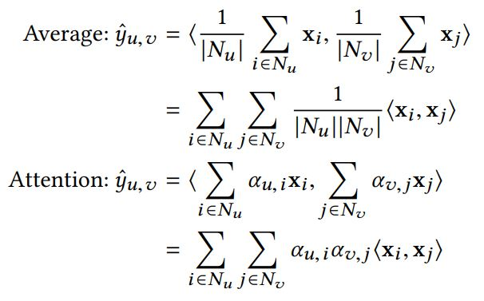
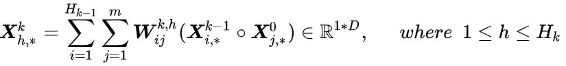
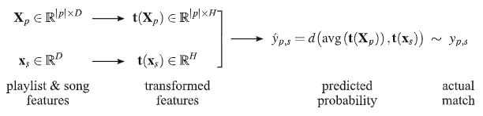
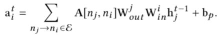
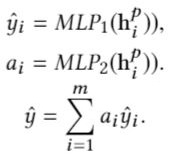

# Research-Paper-Note
My research paper notes, focusing on data mining/recommender/reinforcement learning. This README.md file is a total collection of all papers in chronological order (key words provided for indexing). There are subcatalog markdown files available for area-specific indexing.

我的论文笔记，主要聚焦于数据挖掘、推荐系统、强化学习。这里是所有论文笔记的汇总，按照时间顺序排列（提供了关键词方便检索），同时可以去具体的分类markdown文档中检索论文。

## Click Models for Web Search

链接：[Survey: Click Models for Web Search](https://www.semanticscholar.org/paper/Click-Models-for-Web-Search-Authors-%E2%80%99-version-*-Chuklin-Markov/0b19b37da5e438e6355418c726469f6a00473dc3?p2df)

关键词：Click Model, CM, Probabilistic Graphical Models, PGM

这篇15年的综述对PGM时代（前深度学习时代）的Click Models进行了完整的总结，基本之后我们做Click Model的文章必然会引用，好文推荐。

## A Neural Click Model for Web Search

链接：[https://dl.acm.org/doi/10.1145/2872427.2883033](https://dl.acm.org/doi/10.1145/2872427.2883033)

关键词：NCM, Click Model, LSTM, User Modeling

以前的click model都是基于概率图模型的，这篇WWW16的文章第一次用神经网络和深度学习去建模click model任务，算是开创性的工作。模型本身十分简单，就是用一个RNN去表示一个doc list的sequence process。文章中没有给出实现代码，我自己成功复现了一版代码[[Link](https://github.com/CHIANGEL/Neural-Click-Model)]，需要注意，我的复现版本和原论文有几点不一样的地方（个人认为是改进）：

- 我没有采用原论文中one-hot的embedding方法，而是直接用PyTorch的nn.embedding对每一个id进行feature初始化，然后让embedding参与梯度更新。原论文的one-hot方法非常笨重，一个embedding可以长达10240维，不仅稀疏，而且很难放入GPU加速。
- 我额外加入了vertical type信息，这个取决于我们采用的数据集有没有这些额外信息。
- 我在每一个RNN的time step都输入了query信息，而不只是用query信息去做初始化，防止query信息被遗忘。

## A Context-Aware Click Model for Web Search

链接：[https://dl.acm.org/doi/10.1145/3336191.3371819](https://dl.acm.org/doi/10.1145/3336191.3371819)

关键词：CACM, Click Model, User Modeling

对Click Model任务进行更加复杂的建模，参考PGM时代Click Model的Examination Hypothesis，CACM将Click Probability分成Examination Prediction和Relevance Estimation两部分建模，然后通过一个Combination Layer进行结合计算出每一个doc的点击概率。可以理解为是通过堆积复杂模型来达到更好的性能，个人感觉没有NCM优雅和灵活。

最重要的是，我认为CACM中的Relevance Estimator的建模是存在一定的问题的，从下图看，Relevance Estimator的Click Context Encoder中已经将document的序列信息也建模进来！但是常识中，query-doc的相关性分数relevance score应该是一个和doc位置信息无关的东西，CACM的建模方式却意味着，**一模一样的query-doc pair，一旦doc的位置发生改变，这个query-doc pair的relevance score也就会发生改变**，这是一件不合理的事情。

## An End-to-End Neighborhood-based Interaction Model for Knowledge-enhanced Recommendation

链接：[https://arxiv.org/abs/1908.04032](https://arxiv.org/abs/1908.04032)

关键词：NI, KNI, Graph, Recommender, KDD Workshop Best Paper

本文主要解决三个问题：

- Data Sparsity
- Cold Start
- Early Summarization

前两个是RecSys中常见的问题，一般GNN的方法都可以缓解，第三个问题则是本文提出的一个新概念，意思是寻常GNN的方法是直接利用目标结点的邻居去生成embedding，这样并没有充分的利用图结构的local structure（比如邻居与邻居之间的交互），因此这个embedding是被“过早”的生成了，缺失了一部分有价值的local信息。

接着，文章以Average Aggregation和Attention Aggregation为例，总结了目前GNN的一种通式：

其中矩阵A是一个系数矩阵，侧重于local structure；矩阵Z则是一对目标结点u，v的邻居的两两组合的内积矩阵，侧重于全局信息。而之前提到的Average Aggregation和Attention Aggregation，其实就是这个通式的特例，即改变矩阵A。因此我们也可以进一步对A进行改进，加入“邻居和邻居”之间的互动关系，从而得到NI模型的公式：

其实相对于Attention Aggregation，NI的不同就在于拼接了更多的结点信息，从而更好地利用邻居信息，一定程度上解决Early Summarization的问题。

上面的讨论还是仅限于User-Item的图结构，如果我们通过引入知识图谱的信息，即更多的Entity和Relation，就可以构建KNI。相比于NI，KNI的区别就是图结构更加丰富，公式和计算过程没有改变。除此之外，KNI和NI都运用了Neighbor Sampling的技术。而也正是因为采用了NS技术，KNI/NI在Evaluation阶段会有一个类似assemble的过程，eval次数越多，sample次数越多，性能会有进一步的提升。因此，文章是每次进行40次eval，然后取平均。

## User Behavior Retrieval for Click-Through Rate Prediction

链接：[https://arxiv.org/abs/2005.14171](https://arxiv.org/abs/2005.14171)

关键词：UBR4CTR, User Behavior Retrieval

CTR预测一般会用到用户的历史信息来产生personalized的预测结果，比如DIN、DIEN都是这方面经典的工作。但是如果用户的历史信息序列过长，我们不可能把该用户所有的历史信息都一股脑放入模型进行预测，这样还带来两方面的坏处：

- 运算时间过长
- 过长的历史信息序列会包含很多的无用信息和噪声，反而不利于预测

因此，目前学界、工业界常用的操作就是直接做一个截断，只把该用户最近的历史信息序列截取过来做CTR预测，这样的操作简单，但是可能会遗漏有价值的信息，比如用户的长期、周期性的行为规律。因此如果从用户特长的历史信息序列中筛选出有价值、低噪声的历史信息用于CTR预测是很重要的，本文就提出了一种基于Attention的用户历史信息筛选机制，来取代目前“简单截断历史信息序列”的粗暴方法。

这其实是一种很简单但很重要的思想，即应该筛选用户的历史信息而不是简单截断。至于这个“筛选”的方法，就可以千变万化，这篇文章中提到的只是一种可能的筛选机制，比如在工业界部署上，为了简化，我们可以通过制定规则来实现筛选，比如和target item属于同一类别的item历史信息应当被重点考虑。

## Graph Attention Networks

链接：[https://arxiv.org/abs/1710.10903](https://arxiv.org/abs/1710.10903)

关键词：Attention, GAT, Graph

ICLR2018的工作，比GraphSage迟一年。GAT将Attention机制引入图神经网络，但和GraphSage类似，还是每次通过将目标结点的一阶邻居想自己汇总信息，来得到最新的node embedding，只不过这个“汇聚”过程不再是简单取平均，而是通过attention机制的加权平均，而attention系数则是有一个**全结点共享**的线性变化层求得：

公式中，LeakyReLU及其里面的a就是那个全节点共享的线性变化层，input是目标结点i和他的一个一阶邻居j的embedding。LeakyReLU外面套的就是一个softmax，即可得到目标结点i的所有一阶邻居j的attention系数（i也算自己的一阶邻居，即添加自环self-loop）。另外，值得注意的是，上面这个attention系数计算公式是对两个节点i,j对称的，因此其实就是图中每条边可以计算出一个attention系数。接着通过对所有一阶邻居的加权得到目标结点i的新embedding：

同时，文章还提出留用multi-head attention来稳定GAT的学习过程，也就是简单的独立的计算多组GAT，然后通过取平均或者拼接的方式进行集成。

## Inductive Representation Learning on Large Graphs

链接：[https://arxiv.org/abs/1706.02216](https://arxiv.org/abs/1706.02216)

关键词：GNN, GraphSage

GraphSage应该是第一个提出图神经网络中inductive和transductive区别的工作（不太确定），transductive是指test set中的节点必须在training set中出现过（只是没有标签），而inductive则是指test set中的节点不一定出现在training set中，也就是在测试阶段允许出现全新的节点，那么难点就在于这些出现的全新节点其实并没有一个很好的embedding（因为没有参与训练），所以inductive比transductive更具备挑战性，也更贴近实际应用场景。

GraphSage通过对目标结点的邻居信息进行聚合操作，来生成目标节点的embedding（可以给目标节点添加自环，使之也考虑自身信息），所以GraphSage主要分为两步，首先是对目标节点的周围邻居进行聚合aggregation，得到一个新的embedding，然后将这个新embedding和目标节点原本的embedding进行拼接、过一个全连接层，最终得到目标节点的output embedding。

上述是GraphSage的通识，然后有三点可以变通和思考的地方：

- 聚合aggregation有多种不同的函数可以选择，比如简单取平均、pooling、LSTM等等，本质上就是把多个input vector信息融合成一个vector
- 一次aggregation没必要把目标节点的所有邻居都拿来算，我们可以采用Neighbor Sampling的技术，每次只从目标节点的邻居集合中采样出K个即可（集合大小不足K，那就有放回的采样），这样既可以使得计算时的数据维度对齐，方便GPU加速，同时也是一种assemble方法。
- 对目标节点，我们可以多次aggregation，每一次聚合，就是向外扩展一层邻居，如此就可以聚合高阶邻居的信息

## Heterogeneous Graph Attention Network

链接：[https://arxiv.org/abs/1903.07293](https://arxiv.org/abs/1903.07293)

关键词：HGAT, HAN, Heterogeneous

原论文给这个模型起名缩写是HAN，但因为该模型可以理解为是GAT在异质图上的扩展，因此有不少人称之为HGAT。本文的attention机制可以分类两层，第一层是node-level attention，第二层是semantic-level attention（其实就是meta-path-level attention），但这里的attention系数是用MLP或者向量内积算出来的。

文章首先给出了一系列的定义，包括meta-path、meta-path based neighbor之类的，详见原文。假设数据集有N个节点，人为定义P类meta-path，对每一个结点i，我们通过node-level attention的到了结点i的P个embedding，此时一共N*P个embedding。

接着，在semantic-level attention阶段，我们要转换思维。在此之前，这N*P个embedding我们会潜意识中将它们分为N类（即按照结点分），接下来我们要按照meta-path将这些embedding分为P类，然后通过semantic-level attention计算出P个attention系数，然后将P类合成一类，得到最终的N个embedding。注意，下图中的取平均，就是对每一类meta-path的N个embedding算出的coefficient求平均，因为当时看论文的时候困惑了一下，所以这里我特意讲到“转换分类思维”的想法。

## TGCN: Tag Graph Convolutional Network for Tag-Aware Recommendation

链接：[https://dl.acm.org/doi/10.1145/3340531.3411927](https://dl.acm.org/doi/10.1145/3340531.3411927)

关键词：Tag-Aware, TGCN, Graph, TRS

TRS (Tag-Aware Recommender)，即user在和item产生交互的同时，会主动给item打上一些标签tag，那么这些tag不仅会反映item的属性，还会反映user的潜在兴趣，是可以利用的side information。本文提出了三点motivation（其实和其他用图做推荐的都大同小异）：

- Cold Start，老生常谈的问题，GNN论文必备motivation
- Ambiguity，tag一般是用字符串表示，而一样的tag对不同的item和user会有不同的含义，比如apple可以是水果，也可以是手机
- Redundancy，和ambiguity对应，不同的tag可能表示一样的含义，比如mobile phone和ceil phone

本质上Ambiguity和Redundancy都是因为单纯的tag缺乏上下文和语义信息，如果引入图，tag节点的邻居就可以提供辨别信息，解决这些问题。

首先是构图，文章的构图方法很简单，一次user和item的交互会产生若干三元组(user, item, tag)，对每一个三元组，我们就分别将user、item、tag彼此连边，同时user-item边权重为1，user-tag和item-tag的权重取决于这个tag在user/item邻居中出现的次数，也就是说，tag出的次数越多，说明这个tag对user/item越重要。

TGCN比较特别的地方在于它做了两层aggregation（node-level和type-level，HGAT/HAN有异曲同工之妙）。对于一个中心节点，在node-level aggregation中，我们先对它的邻居按类型进行分别sample和attention，在本文中，也就是三类邻居节点，分别求出三个embedding用以表示中心节点的邻居信息，然后在通过type-level aggregator进行邻居之间的信息整合。

显而易见，我们在type-level aggregation也可以简单地采用attention机制，但是TGCN认为我们应该将特征交叉的思想拿进来，所以TGCN没有把所有的node-level邻居向量用attention合成一个，而是拼成一个2D矩阵（类似于图片），然后参考CV中的卷积层，提出了横向/纵向两类卷积特征交叉方法，具体可以看论文。

type-level aggregation结束后我们就得到了user和item的embedding，最后一个简单的内积就可以求得user-item的CTR。

除此之外，TGCN还提出了TransTag，其实就是在端到端训练的loss function中加入一项。具体来说，就是参考了TransE的思路，认为tag是连接user和item的一类特殊边，所以在embedding层面上，user + tag应该和item尽量接近。这一点的提出也有很形象的可解释性，user1和user2都和item1发生了交互，但他们发生交互的原因可能是不一样的，比如user1是因为价格低，user2是因为好看，而这样的区别就是由tag提供的。

## Hypergraph Convolution and Hypergraph Attention

链接：[https://arxiv.org/abs/1901.08150](https://arxiv.org/abs/1901.08150)

关键词：Hypergraph, Attention, HyperConv, HyperAtten

超图（HyperGraph）是这样的：若图中的一条边可以连接两个甚至更多的节点，那么这样的边被称为超边（HyperEdge）；由超边构成的图即为超图。比如推荐系统中，user和一个带有tag属性的item产生了交互，则我们可以认为user-item-tag是一条超边。普通的图的定义是超图的子集，因此超图本身就带有更多的信息，值得被挖掘。

我们会用一个incidence matrix H去表示超图的边集合，假设超图中有N个节点，M个超边，则矩阵H的大小即为N×M，每一列代表一条超边，若一个节点在被该超边所连接，则矩阵元素记为1，否则记为0。同时会有一个形状为M×M的对角矩阵，存放每一个超边的权重（一般我们可以全部设为1）。

本文中的超图卷积（Hypergraph Convolution）算子是基于两个假设：

- 一条超边所连接的节点们应该有更多的信息传播
- 一条超边的权重越高，它的信息传播越重要

由此，我们可以定义单步的超图卷积算子以及其矩阵形式：

因为上述公式中的HWH^T的谱没有约束，这可能导致梯度爆炸或者梯度消失，因此需要加入归一化项：

之后，文章还提出了一种超图上的learnable attention结构（超图卷积本身就是一种attention，但不是learnable的），但是做了一个强假设：节点和超边是处于同一个向量空间，因此我们可以去比较节点和超边之间的相似性。最后，文章还证明了传统图卷积是超图卷积的一个特例。

但这种hypergraph的方法有一个缺点在于，这个incidence matrix H限制了超图的大小，如果超图的超边数量上去了，很可能就会爆内存，不容易实现。

## metapath2vec: Scalable Representation Learning for Heterogeneous Networks

链接：[https://dl.acm.org/doi/10.1145/3097983.3098036](https://dl.acm.org/doi/10.1145/3097983.3098036)

关键词：metapath2vec, Heterogeneous Graph, Graph Embedding, Representation Learning

这是一篇关于graph embedding的工作，一般不会作为一个GNN模块插入Embedding层和Prediction层之间（比如GAT/GCN/GraphSage）。本文其实就是Deepwalk/node2vec系列方法在异质图上的改版，通过metapath游走来得到一系列的节点上下文，然后再用Word2Vec中的skip-gram模型进行表示学习。

首先是如何基于metapath进行随机游走：

简而言之，随机游走的路径必须符合metapath指定的节点顺序，如果当前节点的邻居有多个节点符合metapath的要求，则是一个均匀概率的随机游走，没有node2vec中对游走概率的控制。

通过随机游走得到了一系列的节点上下文，接着我们就可以利用skip-gram模型进行embedding learning。在这一步中，论文提出了两种算法：metapath2vec和metapath2vec++，二者在随机游走阶段的算法是一致的，只是在skip-gram时有些微不同。metapath2vec的softmax是在所有节点上进行归一化（不区分节点类型），而metapath2vec++则是区分节点类型，softmax是在同类节点上进行归一化。最后，和skip-gram一样，我们通过负采样来优化加速。

这篇文章很经典，但是我认为有以下两点不足：

- 虽然说是考虑异质图，但是却假设不同类型节点的embedding存在于同一个隐向量空间，这样可能会损失部分信息（对比Trans系列的工作）
- 最致命的缺点在于，原文算法和实现算法都仅支持利用一条metapath去进行随机游走，但是在一个复杂异质图上，必然存在多种有价值的metapath。
- 更进一步，如果我们用多条metapath去随机游走采样，那如果平衡不同metapath采样出来的节点上下文数量和重要性又会成为一个新的问题，因此不能简单地把metapath2vec从单条metapath扩展到多条metapath，这也成了该算法最致命的局限性。

## Representation Learning on Graphs with Jumping Knowledge Networks

链接：[https://arxiv.org/abs/1806.03536](https://arxiv.org/abs/1806.03536)

关键词：Graph, Representation Learning, Deeper, JK-Nets

本文的motivation是想要解决传统GCN中oversmoothing和less-information的问题。众所周知，传统的GCN不能太深，一般2层就是最优了。

参考上图，我们有以下分析结论：

- a处于dense core中，四步更新基本可以拿到整个graph所有节点的信息，进而引发over-smooth的问题：节点聚集更多更广的邻居信息，则表达更global/更平滑，导致很多节点的表达基本一致而没有区分性。
- b处于边缘，即使是四步更新，能拿到的邻居信息也是寥寥无几，和a产生鲜明对比，这个问题我们称之为less-information
- 对比b和c，只是在多加了一层（4步更新和5步更新），处于边缘的节点能拿到的节点信息就忽然倍增，甚至可能引发over-smooth的问题

综上，我们很难把握合适的GCN层数，不同的节点、不同的层数都可能导致邻居信息的天差地别，因此导致“传统GCN不能太深”的问题。而这个问题的本质在于：**有的节点需要更多的local信息，有的节点需要更多的global信息，需求不同，但是传统GCN的neighbor aggregation往往是一致对待**。由此，本文提出了layer aggregation的解决方案。

layer aggregation其实就是让模型自己去决定每一个节点需要什么，上图的4层GCN，底层GCN的local信息更多，高层GCN的global信息更多，而这四层的信息会一起通过顶层的layer aggregation，计算得到最终的embedding，也就是通过layer aggregation去平衡local和global的信息。

上图中，纵向是neighbor aggregation，横向是layer aggregation，两种aggregation都可以多种选择，比如Average、Concat、Pooling、LSTM等。而模型之所以取名为Jumping Knowledge，是因为所有GCN层的信息，都jump到了layer aggregation层，因此得名。

## Modeling Relational Data with Graph Convolutional Networks

链接：[https://arxiv.org/abs/1703.06103](https://arxiv.org/abs/1703.06103)

关键词：Graph, RGCN

RGCN就是根据不同类型的边进行分类聚合，核心公式就是下面这一条：

对每一类型的边，有一个转换矩阵theta，对一个目标节点，它的所有邻居根据连边类型进行分别聚合，而各自类的邻居之间去简单平均。文章说RGCN可能会面临过拟合的问题，因为按照连边类型进行分别聚合需要用到多个转换矩阵，当边的类型数量很多的时候（尤其是在知识图谱这种边类型巨多的场景下），RGCN会有过多的模型参数，会带来过拟合问题。因此文章还提出了两种Regularization方法。

第一种被称为basis-decomposition，所有边类型的转换矩阵都是由同一组原始矩阵的线性组合得到的：

其中，这一组原始矩阵的数量也是一个超参数。本质上，这利用了参数共享的思路，每一个边类型所需要拟合的模型参数就大幅下降了。

第二种被称为block-diagonal-decomposition，即每一个边类型的转换矩阵是由一系列的低维矩阵拼成的对角矩阵：

不同于第一种的参数共享思路，这是从稀疏矩阵的思路出发，也不错。但实验表明，具体要不要用regularization方法、哪种regularization好，都是具体任务具体分析。

## Factorization Machines

链接：[https://link.zhihu.com/?target=https%3A//www.csie.ntu.edu.tw/~b97053/paper/Rendle2010FM.pdf](https://link.zhihu.com/?target=https%3A//www.csie.ntu.edu.tw/~b97053/paper/Rendle2010FM.pdf)

关键词：FM

普通的LR线性模型，我们只是将各个特征独立考虑，并没有考虑到特征与特征之间的互相关联，严重的可能会导致[辛普森悖论](https://zh.wikipedia.org/wiki/%E8%BE%9B%E6%99%AE%E6%A3%AE%E6%82%96%E8%AE%BA)。因此在CTR预估中考虑特征交互是非常重要的，以常见的二阶交叉为例，下面是通用的二阶交叉公式：

第一项是偏置项，第二项是一阶特征（没有交互），第三项是二阶特征交互，两两特征之间的交互被赋予一个权重w。但是这样的二阶交互复杂度极高，是O(N^2)。而FM的改进就是针对这个二阶交叉权重提出的，对每个特征，FM额外训练一个隐向量v，则两个特征交互的权重就由对应的两个隐向量点乘得到，即：

FM大幅度降低了二阶交叉的复杂度，从O(N^2)降到了O(NK)，模型需要估计的参数是：

除此之外，FM还解决数据稀疏性的问题，提高模型泛化能力。因为隐向量的存在，即使训练数据中没有特征值x与特征值y的交互出现，我们仍然能够在测试阶段预估特征值x与特征值y的交叉情况。缺点上，由于组合爆炸的问题限制，FM模型不易扩展到三阶特征交叉。

## Field-aware Factorization Machines for CTR Prediction

链接：[https://www.csie.ntu.edu.tw/~cjlin/papers/ffm.pdf](https://www.csie.ntu.edu.tw/~cjlin/papers/ffm.pdf)

关键词：FFM

FFM在FM的基础上提出了域（Field）的概念。首先我们需要明确，特征就是指某一个特征值，比如男性是一个特征，女性、中国、美国、日本、耐克、阿迪达斯都是一个一个的特征。而域可以理解为是对一系列特征的一种归纳划分，比如男性、女性属于“性别”这个域，中国、美国、日本属于“国家”这个域，耐克、阿迪达斯属于“运动品牌”这个域。

假设我们一共有n个特征，对这些特征划分出f个域。在FM中，我们对每一个特征都训练一个隐向量，共需要n个隐向量。而在FFM中，我们对每个特征都会训练f个隐向量，分别对应f个域，一共需要n*f个隐向量。当特征x和特征y做交互的时候，特征x会根据y所在的域挑选出自己隐向量组（一组一共f个隐向量）中对应的向量，特征y同理，然后两个挑选出来的隐向量内积得到特征交互的权重。本质上，FM就是只有一个域的FFM。

缺点上，FFM因为引入了特征域的概念，计算复杂度从O(NK)上升到了O(KN^2)，训练开销大。

## Attentional Factorization Machines: Learning the Weight of Feature Interactions via Attention Networks

链接：[https://arxiv.org/abs/1708.04617](https://arxiv.org/abs/1708.04617)

关键词：AFM

AFM就是在FM的基础上，给每一个二阶特征交互学一个attention系数，然后加权求和。

## Deep Crossing: Web-Scale Modeling without Manually Crafted Combinatorial Features

链接：[https://dl.acm.org/doi/10.1145/2939672.2939704](https://dl.acm.org/doi/10.1145/2939672.2939704)

关键词：DeepCrossing

DeepCrossing就是最简单的DNN，将所有的embedding拼起来，然后一起过MLP。而在MLP中，作者采用了residual的结构。

## Deep Learning over Multi-field Categorical Data: A Case Study on User Response Prediction

链接：[https://arxiv.org/abs/1601.02376](https://arxiv.org/abs/1601.02376)

关键词：FNN

FNN的结构和DeepCrossing基本一致，就是embedding拼接+MLP，只是MLP中不存在residual结构。FNN最大的不同在于，它用FM训练好的参数对feature embedding进行了初始化，加速模型的收敛，以及优化模型性能。

## Wide & Deep Learning for Recommender Systems

链接：[https://arxiv.org/abs/1606.07792](https://arxiv.org/abs/1606.07792)

关键词：Wide & Deep, CTR Prediction

Wide部分是类似逻辑回归的简单模型，具备**记忆能力**，即模型直接学习并利用历史数据（共现频率）的能力。Deep部分是深度神经网络等复杂模型，具备**泛化能力**，即发掘稀疏或未出现的稀有特征以及标签相关性的能力。Deep部分就是将各类数值特征和离散特征embedding拼起来，一起过MLP。Wide部分则会有特征筛选的过程，人工选出需要被直接利用的特征，进入单层模型（比如LR）。

## Neural Factorization Machines for Sparse Predictive Analytics

链接：[https://arxiv.org/abs/1708.05027](https://arxiv.org/abs/1708.05027)

关键词：NFM

之前WideDeep、DeepCrossing之类的模型结构，都只是将embedding简单拼接然后过MLP，以此学习特征交叉，但是这样可能学得不好，因为是简单拼接。因此NFM提出一种Bi-interaction Pooling操作，将embedding以优于简单拼接的方式结合起来，然后过MLP。一句话概括就是，所有embedding vector两两做元素乘，然后全部加和，n个k维向量最后压缩成一个k维向量。这个核心模块取代了FM的二阶特征交叉部分，FM的一阶线性部分则保留，最终得到NFM的结构。

## Deep & Cross Network for Ad Click Predictions

链接：[https://arxiv.org/abs/1708.05123](https://arxiv.org/abs/1708.05123)

关键词：DCN, CTR Prediction

DCN改进了Wide&Deep中的Wide部分，用Cross Network来代替原本的LR，使得Wide部分具备了自动特征交叉的能力，这个改进方向和DeepFM是一致的，只是两个工作对Wide部分的改进方案不同。DCN的Cross Net的核心公式如下图所示：

每层Cross都仅增加一个n维的权重向量$w$，并且每次都有原始输入$x_0$，使得输入输出的差距不会很大。相比于Wide&Deep，DCN因为有了自动特征交叉的能力，所以不需要做人工的特征筛选，并且多层Cross的设计可以建模高阶特征交叉，是一大改进。至于具体Cross Net如何做到高阶特征交叉，这篇知乎文章给出了一个详细的例子，可以参考：[https://zhuanlan.zhihu.com/p/55234968](https://zhuanlan.zhihu.com/p/55234968)。

## DeepFM: A Factorization-Machine based Neural Network for CTR Prediction

链接：[https://arxiv.org/abs/1703.04247](https://arxiv.org/abs/1703.04247)

关键词：DeepFM, CTR Prediction

如上图，相比于FM，DeepFM就是额外加了一个MLP模块，将所有的feature embedding拼接起来喂给MLP，输出一个scalar，然后和FM的输出一起进入Output Layer。DeepFM是针对Wide&Deep的Wide部分进行了改进，用FM代替了原来的LR，增加了Wide部分的自动特征交叉的能力。这个改进方向和DCN是一致的，都是增强了Wide部分的自动特征交叉能力，只是DeepFM用了FM，而DCN则是用了多层Cross Network，具体谁好谁坏，要看场景和数据集了。

## Product-based Neural Networks for User Response Prediction

链接：[https://arxiv.org/abs/1611.00144](https://arxiv.org/abs/1611.00144)

关键词：PNN, CTR Prediction

可以和上面的DeepFM结合起来看，PNN就是把所有的feature embedding和feature interaction（交互出来的一堆scalar）拼接起来，一起放入MLP，输出最终的预测分数。

## xDeepFM: Combining Explicit and Implicit Feature Interactions for Recommender Systems

链接：[https://arxiv.org/abs/1803.05170](https://arxiv.org/abs/1803.05170)

关键词：xDeepFM, CIN, CTR Prediction

xDeepFM应该来说算是DCN的近亲，而非和DeepFM关系紧密。DCN和DeepFM都是针对Wide&Deep中的wide部分进行改进，DeepFM用了FM做特征交互，DCN则用CrossNet做特征交互。FM建模二阶，CrossNet则由层数决定几阶特征。FM建模vector-wise的交互，而CrossNet是bit-wise的交互。而xDeepFM提出的CIN模块，希望做到类似CrossNet，但建模vector-wise的特征交互。

CIN每一层也是将上一层的输出和原始特征作为输入，输出$H_k$个向量。我们首先把原始特征向量(m个)和上一层的输出向量(n个)进行两两的element-wise product，得到m*n个交互向量；我们为这一层维护$H_k$个权重矩阵，输出的$H_k$个向量，就是这些交互向量的$H_k$中加权求和向量。同层不同vector的区别仅仅在于不同的加和权重矩阵，我们可以提前计算好两两向量间元素乘的结果。CIN名字中的Compressed就源于此，即对一系列向量进行“压缩”。

相比于CrossNet，CIN的第n层是输出了n+1阶特征交互，CrossNet则是输出了1至n+1阶的特征交互。因此CrossNet只需要最后一层作为输出，而CIN是所有层的输出拼接作为总输出，都代表1~n+1阶的特征交互。造成这一点差异的原因是，CrossNet除了原始特征和上一层输出的交互外，每一层还会额外加上原始特征。在最后的output layer，CIN会对每一层的$H_k$个向量进行sum pooling，即求和得到一个向量，然后将k层k个向量拼起来，作为最终的特征交互向量。

另外，可以把FM理解为是CIN的一种特例，当CIN只有一层，该层只输出一个向量，且权重矩阵均为1，就等价于FM的二阶特征交互了。CIN只是xDeepFM的核心模块，还可以拼上DeepFM的MLP和FM，或者其他模块，组成最后的xDeepFM。

## AutoInt: Automatic Feature Interaction Learning via Self-Attentive Neural Networks

链接：[https://arxiv.org/abs/1810.11921](https://arxiv.org/abs/1810.11921)

关键词：AutoInt, Multi-head Self-attention

AutoInt和xDeepFM一样提出了一个核心模块Interacting layer，利用multi-head self-attention去做特征交叉，这个核心模块和拼上DNN或者FM，最终整合得到预测分数。这个interacting layer如下所示：

对每一个特征，用着自己做key，和其他特征交互得到alpha，然后加权求和。因为是multi-head，所以每个特征有H个交互结果，作者将它们进行拼接，最后用residual的方式重新加回给原始特征向量。DeepCrossing和AutoInt都有残差的设计，但DeepCrossing只是用了简单的MLP，性能上不如AutoInt。

## An Adversarial Imitation Click Model for Information Retrieval

链接：[https://chiangel.github.io/files/publication/An_Adversarial_Imitation_Click_Model_for_Information_Retrieval.pdf](https://chiangel.github.io/files/publication/An_Adversarial_Imitation_Click_Model_for_Information_Retrieval.pdf)

关键词：AICM, Click Model, User Modeling, Imitation Learning, GAIL

这是一篇用模仿学习+深度学习去做Click Model任务的文章，是模仿学习中的GAIL框架，也就是对抗训练的过程。AICM重新审视了Click Model这个task，认为Click Model对用户行为的建模过程本质上是一种行为模式（Policy）的模仿，因此可以把User Click Log认为模仿学习中的专家数据，那么Click Model任务就很自然的变成了一种对专家数据的模仿学习过程。

整体结构上，AICM遵循GAIL框架，设置了一个Generator和一个Discriminator。Generator本质就是一个Click Model（Policy），在给出一个Doc List后，Generator会产生一系列的点击信息，组成和User Click Log数据格式一致的生成数据。Discriminator则是一个打分器，用于鉴别输入的User Click Log数据是real data还是generated data。而Gnerator（即Click Model）的Objective就是由Discriminator的输出得到。具体结构上，Generator（即Click Model）和Discriminator均采用了和NCM一致的GRU结构。

除了结构上的创新，AICM还提出了一个针对Click Model的新评价指标：Reverse PPL和Forward PPL。在此之前，Click Model的Evaluation主用采用Log-likelihood (LL)、Perplexity (PPL)和NDCG，这些指标其实只是将Click Model视为一种预测模型（Predictive Model），但Click Model是需要为下游任务提供点击信息的指导，所以更应该被视为一种生成模型（Generative Model），因此我们需要对训练得到的Click Model的泛化性能进行评估，即衡量Click Model生成的数据的概率分布，与真实数据的概率分布之间的差异程度。基于此，AICM提出了Reverse PPL和Forward PPL评价指标。

很显然，我们的目标是比较生成数据和真实数据内在概率分布的差异程度，可行的思路是我们使用一个中间代理模型Surrogate Model（是另一个Click Model），让代理模型在生成数据上进行训练，在真实数据上进行测试；或者让代理模型在真实数据上进行训练，在生成数据上进行测试；测试结果越好，就说明生成数据和真实数据的一致程度越高，生成数据的Click Model作为Generative Model的泛化性能就越好。而上面提到的代理模型“在生成数据上训练、真实数据上测试”和“在真实数据上训练、生成数据上测试”就分别对应了Reverse PPL和Forward PPL两个新指标。

## Denoising Implicit Feedback for Recommendation

链接：[https://arxiv.org/abs/2006.04153](https://arxiv.org/abs/2006.04153)

关键词：ADT, Denoise, Noisy Label, Implicit Feedback, Recommendation

目前关于Learning with Noisy Label的工作主要集中在CV领域，Noisy Label在Recommender领域的定义本身就比较模糊，甚至很多人会把noise和bias混为一谈，本文可以说是第一篇为推荐领域明确定义了Noisy Label的概念（之前也有工作focus在推荐领域的nosie label上）并且提出了无需额外数据即可达成denoise目标的训练方法。

首先我们来定义在推荐系统领域下，什么是Noisy Label。在推荐领域，我们往往认为Click即为一种Positive Feedback，但其实很多时候，用户的点击并不能真正代表他的喜好。比如我因为标题党点进了一篇新闻/推送/视频等，但是估计我一进去两三秒就发现不对，直接退出，这样的Click就是一种Noise。再举一个例子，在电商中，用户可能会点击或者购买某一个产品，但是最终却会给出一个较低的评分（rating），这时候的Click我们也认为是一种Noise。综上所述，如果一个Click发生，但是却并不能反映用户的**真实**喜好，那么这个Click就是Noise，在论文中被称为false-positive interaction。而衡量false-positive自然需要一些额外信息，比如用户点进去的停留时间（dwell time）或给出的评分（rating）。

之前也有不少工作是针对这样的Noisy Label（即推荐领域中的false-positive interaction），但这些工作往往都需要在训练中加入额外信息（比如停留时间或评分）来指导识别可能的noisy sample，但是如此方法的缺点在于，本身click信息就已经是稀疏的，这些方法要求在click的同时还要具备评分等额外信息，于是就是稀上加稀，难以训练，也不现实。而本文提出的ADT方法，是不需要在训练中加入额外信息，就可以做到denoise的。

从方法上看，ADT其实就是一种sample reweighting的思路。因为noise sample的特点就是难以拟合，所以训练过程中loss偏大的sample更可能是noise sample，则我们应该要降低这些sample的权重，使得网络的更新偏重于那些loss更低、更可能是clean sample的样本。ADT有两种reweighting方法，一种是直接截断，即loss大于某个阈值的sample的loss直接手动归零（阈值会随训练进程而变化，因为整体loss会随着拟合过程下降），。另一种则是给每一个sample加上一个动态的reweighting系数，这个系数是和model预测的[0,1]的click rate有关，预测的点击率越接近0.5，说明model对这个sample的预测越不确定，就越有可能是noise sample，则权重更低。

整体来说，我认为这篇文章的意义在于为推荐系统领域制定了一个较好的setting，也就是如何在不使用额外信息的情况下对implicit feedback进行denoise training，文章提出的ADT中的两种reweighting思路，在CV领域的denoise method中早有人做过，不是新思路。因此，也许之后尝试将更多CV领域的denoise方法迁移到这个setting上会是一个不错的水论文的方向。

## Co-teaching: Robust Training of Deep Neural Networks with Extremely Noisy Labels

链接：[https://arxiv.org/abs/1804.06872](https://arxiv.org/abs/1804.06872)

关键词：Co-teaching, Noisy Label, Denoise

本文提出了一种新的训练模式（learning paradigm），基于经典假设：Noise Sample的Loss会比Clean Sample更大，网络可以据此判断哪些更可能是clean sample。Co-teaching同时训练两个网络，每一个mini-batch，两个网络都会根据自己计算的loss挑选出一部分可能的clean sample，然后喂给彼此进行更新。

Co-teaching需要解答的一个问题就在于，为什么网络自己挑出来的clean sample，不给自己做update，而是要喂给别人进行update呢？文章给出的解释是，用自己挑出来的clean sample进行更新，就类似于boosting，会对Noisy Label等异常样本非常敏感。而Co-teaching的方式中，两个网络会学到略有不同的decision boundary，因此可以给彼此纠错。文章举的一个形象例子是，一个学生做题，自查很难发现自己的错误，但如果两个学生互查，就可以找到彼此的错误。但是这个说法其实没有太说服我，用自己调出来的sample做训练，其实就是一种sample reweighting的方法， 把可能是noise sample的直接loss归零，这是存在的方法，只是denoise性能上无从比较。

## Neural Collaborative Filtering

链接：[https://arxiv.org/abs/1708.05031](https://arxiv.org/abs/1708.05031)

关键词：NCF, GMF, NeuMF

NCF是率先将NN引入RecSys/IR领域的文章之一，但是这边文章本身其实略带争议，大概的吃瓜可以知乎问题：[https://www.zhihu.com/question/396722911](https://www.zhihu.com/question/396722911)。本文是在MF的基础上引入了NN来提升性能，作者先指出传统MF的不足：

1. MF中的user隐向量和item隐向量是在同一个向量空间，不太合适
2. MF用到Jaccard Coefficient作为真实的similarity去拟合
3. MF只用一个简单的inner product去衡量两个向量之间的相似程度，这可能会和共现矩阵中的row/column冲突

于是，作者首先提出一个NCF的框架，即用NN来代替innner product来衡量两个向量的similarity。基于这个NCF的框架，作者首先提出了两种基于NCF框架的模型：GMF和MLP。GMF是定制NCF框架中的NN部分，使得这个模型和传统MF干一样的事情，即让user和item的embedding进行element-wise product后在通过一个linear层，但是整体的训练框架遵从NCF。而MLP则是讲user与item拼在一起然后过一个MLP层。可以看到，GMF和MLP其实各占优点，因此作者最后提出了NeuMF模型，结合了上述的GMF和MLP结构。

## Decoupling "when to update" from "how to update"

链接：[https://arxiv.org/abs/1706.02613](https://arxiv.org/abs/1706.02613)

关键词：Decoupling, Noisy Label, Denoise

这篇文章的核心思想还是针对所谓的“small loss”进行，即noise sample类似于hard sample，前期loss较大。而神经网络的拟合规律是先拟合简单样本，再拟合困难样本。因此Decoupling提出，应该让神经网络在训练前期拟合batch data中的大部分数据，随着训练的进行，batch中用来拟合的数据也应该越来越少。

基于，Decoupling提出，同时训练两个网络，这两个网络的结构一模一样，唯一的区别来自于不同的参数随机初始化。之后，针对同一个batch data，两个网络会分别进行预测，然后只在它们预测有分歧的样本上进行更新 (disagreement)。因此在训练前期，两个网络是分别随机初始化，所以disagreement大，用于更新的样本多；之后随着训练进行，两个网络朝着相近的optimal方向优化，因此disagreement逐渐减小，从而一个batch中用于更新的样本量也下来了，符合之前的初衷。

Decoupling算法很简单，文章用很大的篇幅从理论上讨论了这种update on disagreement算法的收敛性和高效性，但是这些理论证明只是linear简化版本，对神经网络的作用仍然只能通过实验进行佐证。

## How does Disagreement Help Generalization against Label Corruption?

链接：[https://arxiv.org/abs/1901.04215](https://arxiv.org/abs/1901.04215)

关键词：Co-teaching+, Noisy Label, Denoise

这篇文章就是结合了co-teaching和decoupling两种方法的结合体，即同时训练两个网络，两个网络结构一致，只是参数随机初始化不同，然后对每一个batch的data，我们首先选取两个网络预测产生分歧的样本组成样本备选集（disagreement），接着我们在这个备选集上进行co-teaching，即两个网络各自选出自己认为loss较小的部分喂给对方进行梯度更新。通过两个网络的分歧选备选集是decoupling的方法，而之后选loss小的样本喂给对方则是co-teaching的方法。这篇文章在方法层面指出了denoise的三点有效的方法：

1. 利用noise sample的loss较大的特点对batch中的样本进行挑选
2. 类似co-teaching，利用两个网络挑选各自的样本给对方进行更新
3. 这第二点cross-update的过程中，应该尽量保证两个网络的差异性，不能让两个网络趋同，否则双网络就退化成和一个网络没有区别了

## AutoRec: Autoencoders Meet Collaborative Filtering

链接：[https://dl.acm.org/doi/10.1145/2740908.2742726](https://dl.acm.org/doi/10.1145/2740908.2742726)

关键词：AutoRec, Collaborative Filtering, Auto-Encoder

这是第一篇将深度学习和自编码器引入推荐领域的开山之作。AutoRec可以分为基于用户（user-based）和基于物品（item-based）两种，我们以item-based为例进行介绍。

假设有m个用户，n个物品，则得到一个m×n的共现矩阵。对每个物品i，所有m个用户对它的评分形成一个m维的评分向量$r_i$，我们通过一个三层神经网络的自编码器（Auto-Encoder）对这n个评分向量进行自编码训练，训练得到的模型就是图中的两个网络矩阵$W$和$V$。$V$将一个高维稀疏向量$r_i$映射为一个低维稠密隐向量$h_{i}^{item}$；$W$则将$h_{i}^{item}$重新映射到m维的预测评分向量$r_i^{pred}$作为输出，这个输出就是m个用户对这个物品i的评分。

Auto-Encoder和Collaborative Filtering以及Matrix Factorization的关系就在于，我们可以把$W$的每一个行向量视为训练得到的user的隐向量$h_j^{user}$，因此从物品隐向量$h_{i}^{item}$经过矩阵$W$到预测评分向量$r_i^{pred}$，其实就是物品隐向量分别和每一个用户隐向量进行内积操作，符合CF和MF的基本原理。而基于Auto-Encoder的神经网络训练则是加强了模型整体的泛化性能。当然AutoRec的缺点也很明显：

1. 神经网络结构简单，表达能力不强
2. 没有考虑更多的特征信息和特征交互
3. 简单的AE结构，可能会学出一个identity mapping

## Deep Collaborative Filtering via Marginalized Denoising Auto-encoder

链接：[https://dl.acm.org/doi/10.1145/2806416.2806527](https://dl.acm.org/doi/10.1145/2806416.2806527)

关键词：DCF, Collaborative Filtering, Auto-Encoder

这篇文章和AutoRec的场景不同，不同点在于我们现在不仅有user-item的共现矩阵（记为$R$），还有user和item各自的特征（记为$X$和$Y$）。因为仅基于共现矩阵的方法往往会受到冷启动的影响，所以我们需要有额外的用户/物品的特征信息来辅助预测，但是这些特征向量往往是高维稀疏的，那自然而然我们就想到，可以用Auto-Encoder的结构去提取稀疏的用户/物品特征向量。

AutoRec是用Auto-Encoder去提取共现矩阵的信息，但DCF是用两个独立的Auto-Encoder网络分别提取用户/物品特征矩阵中的信息，从隐层中拿到用户和物品特征向量（$X$和$Y$）在低维空间的稠密映射（$U$和$V$），接着我们要求$U$和$V$各自隐向量的内积可以和共现矩阵$R$的评分结果接近。因此整个模型的Loss Function有四项：

四个Loss分别是隐向量和共现矩阵的损失、两个自编码器的损失和正则化项。论文中的自编码器选择了一种叫做Marginalized Denoising Autoencoder的自编码器，是一种普通AE的变种，我没有细看。

## Collaborative Denoising Auto-Encoders for Top-N Recommender Systems

链接：[https://dl.acm.org/doi/10.1145/2835776.2835837](https://dl.acm.org/doi/10.1145/2835776.2835837)

关键词：CDAE, Collaborative Filtering, Auto-Encoder

CDAE的应用场景和AutoRec一致，和DCF不同，即只有共现矩阵，不考虑用户或物品的特征向量。

CDAE的整体框架和User-based AutoRec很像，输入是单个用户对所有物品的评分向量，通过三层神经网络的AE来完成从input到hidden到output的自编码过程，但是CDAE在AutoRec的基础上做了两点改进：

1. 因为是user-baed，所以input除了用户对所有物品的评分，CDAE还增加了一个user-specific的用户特征向量$V_u$，即上图中的红线是user-specific，而黑线则是全局共享。因此在计算隐层向量$z_u$的公式为：

   
2. CDAE参考了Denoising Auto-Encoder(DAE)的方法，即对输入的用户评分向量进行概率为$q$的dropout（和神经网络的dropout类似，要给没置零的node乘上系数$1/(1-q)$来保证整体输入的期望不变）。Input的用户评分向量是dropout的，而user-specific vector $V_u$ 不参与dropout，因此可以让整个自编码的学习过程更加鲁棒，减少模型学成identity mapping的风险。

## Variational Autoencoders for Collaborative Filtering

链接：[https://arxiv.org/abs/1802.05814](https://arxiv.org/abs/1802.05814)

关键词：Multi-VAE, VAE_CF, Collaborative Filtering, VAE

这篇文章结合VAE和CF，使用场景和AutoRec、CDAE一样，只有共现矩阵，没有用户/物品的特征向量，并且也是基于用户的，即针对每一个用户的打分向量进行自编码。

首先我们理解一下什么是VAE。上图展示了AE、DAE、VAE的区别。AE不存在sample，DAE是对input vector进行随机dropout。AE和DAE都是将input vector映射为一个固定数值的隐向量，而VAE则是将input vector映射成一个正态分布（隐向量的每一维都用一个正态的均值+方差表示），接着在这个映射得到的正态分布上sample出一个隐向量$z$，用于后续的解码操作。

Multi-VAE for CF的自编码过程相较于正常的VAE，做了两点改进：

1. 传统AE及其变种，都假设解码后的输出符合高斯分布，因此Loss采用的是MSE（即差的平方）；但Multi-VAE假设解码后的输出符合多项分布，因此使用的是Log Loss
2. 作者claim损失函数中的正则化项的系数不应该是1，调成0.2之类较小的值更合适，作者称其为部分正则化（partially regularized）

## Neural Graph Collaborative Filtering

链接：[https://arxiv.org/abs/1905.08108](https://arxiv.org/abs/1905.08108)

关键词：NGCF, Collaborative Filtering, Graph Embedding

NGCD的思路就是把user-item的共现矩阵构建成一个user-item的二部图，然后在这个图上做GNN的消息传递（message passing）来构建user/item的embedding，最后还是通过user-item的embedding的内积来预测CTR。这user-item图上做消息传递的好处在于可以建模多跳（multi-hop）信息，其实也就是协同信息（collaborative information），比如下图中，u1和u2都点击了i2，那么u2的信息会通过二跳传递给u1。

消息传递上，NGCF和传统GNN有略微的不同，NGCF不仅把src的信息更新给dst，还传递了src和dst的交互信息：

信息聚合上，NGCF会额外聚集自身节点的信息，即给每个节点都添加自环：

上述是一次消息传递，重复上述操作，就可以建模user-item图上的多跳信息，得到所有节点的i-hop embedding (i=1,...,n)，将这n个embedding拼接起来，就得到了节点要用于预测的embedding。预测过程还是简单的将user和item的最终的embedding做一个内积。

Optimization上，不同于NeuMF中的Log Loss，NGCF优化的是pairwise BPR loss，即对一个user的positive item和negative item进行优化：

## Deep learning in music recommendation systems

链接：[https://www.frontiersin.org/articles/10.3389/fams.2019.00044/full](https://www.frontiersin.org/articles/10.3389/fams.2019.00044/full)

关键词：Music Recommendation, Deep Learning, Survey

非常值得一度的survey，以此入门音乐推荐领域。这篇文章很好的概括了音乐推荐和其他推荐场景的差异点，然后从Music Information Retrieval和Sequential Music Recommendation两个子领域出发去介绍音乐推荐。

## Carousel Personalization in Music Streaming Apps with Contextual Bandits

链接：[https://dl.acm.org/doi/10.1145/3383313.3412217](https://dl.acm.org/doi/10.1145/3383313.3412217)

关键词：Contextual Bandit, Carousel Personalization, Online Learning to Rank, Music Recommendation

这篇是RecSys2020的短文，虽然论文说做的setting是Carousel Personalization，但其实就是套壳版的OLTR问题，个人认为没有值得follow的价值。

1. 论文claim的contribution之一是在simulator中引入cascade的概念，但是cascade model是OLTR的一种基础CM，没有novelty。而且论文中的三种reward feedback例子和实际的代码实现有差异，容易产生误导，以为文章提到的cascade和正常的cascade model有差异，但其实代码实现上其实是一模一样的。
2. 论文的simulator本质上就是一个pointwise的CTR model，甚至连sequential的信息都没有考虑，而OLTR中CM都能做到sequential prediction。
3. 将问题建模成multi-arm bandit with multi plays也是正常的OLTR做法，且论文给出的policy ranker算法并无创新
4. 论文release了一个数据集和一个simulator，但是既然和OLTR没有差异，也没有music的特质，那我们完全可以直接用Yahoo之类的经典benchmark

## Exploiting Music Play Sequence for Music Recommendation

链接：[https://dl.acm.org/doi/10.5555/3172077.3172400](https://dl.acm.org/doi/10.5555/3172077.3172400)

关键词：song2vec, MF, word2vec

用户听音乐一般都是一个session，因此可以得到一个用户的听歌音乐序列，显然这个序列上相邻的音乐是在某些特性上有相似之处的，因此本文借助word2vec的思想，学出每一首歌的embedding，那么两首歌的embedding的cosine就是这两首歌的similarity。因此学完N首歌的embedding后，我们可以用两两之间的cosine建立一个N×N的歌曲相似度矩阵。

接着因为要做的任务还是给用户推荐音乐，所以base method是正常的矩阵分解算法，对user-music的共现矩阵进行矩阵分解，但是本文在通常MF objective的基础上，加入了对song similarity的限制。即对于分解出来的user vector和music vector，不仅要求user-music内积得到的rating score和共现矩阵接近，还要求music-music内积得到的相似度和歌曲相似度矩阵也接近。

这是一篇17年IJCAI的文章，现在看来很normal，主要是出的早。

## Online learning to rank for sequential music recommendation

链接：[https://dl.acm.org/doi/abs/10.1145/3298689.3347019](https://dl.acm.org/doi/abs/10.1145/3298689.3347019)

关键词：Online Learning to Rank, Counterfactual, Dueling Bandit, CDB

本文focus的场景是交互式音乐推荐（next-track recommendation），也就是每次推一首歌，拿到用户的反馈，再推下一首。作者把这个场景建模为Multi Arm Bandit with Single Play问题，然后用Multi Dueling Bandit的思路去解决。但在这个场景下的问题在于，因为每次只能推一首歌，没办法像寻常OLTR的一样通过interleave的方式比对current ranker和candidate ranker的好坏，因此作者提出一种counterfactual的方法去评估不同ranker之间的优劣，具体细节不展开，同时这篇论文没有开源代码，所以实验细节部分我也没太看明白，只get了整体思路。

## Contextual and Sequential User Embeddings for Large-Scale Music Recommendation

链接：[https://dl.acm.org/doi/abs/10.1145/3383313.3412248](https://dl.acm.org/doi/abs/10.1145/3383313.3412248)

关键词：Music Recommendation, Context, Sequence

因为用户的听歌行为是可以按session进行划分的，本文发现用户在session与session之间的会有序列变化，而这个变化一部分源于context，一部分源于general preference，因此提出要在session-level去建模user preference，即在一个session开始前预测用户当前的preference，然后基于此去预测该session下用户喜欢的tracks。而之前的Sequential Music Recommendation一般指考虑intra-session的序列预测，没有考虑inter-session的preference变化。

本文没有考虑music特征，是类似于IJCAI17那篇文章，直接用word2vec方法从历史音乐序列中学出了music的embedding（单位向量化），然后在之后的训练中固定music embedding不同。如此一来，文章假设user preference embedding和music embedding处于同一个向量空间，固定了music embedding，之后我们只要学出一个user preference embedding，就可以通过cosine距离找到最适合当前preference的music。

每首歌的embedding都是固定的，由此我们可以对一个session的前10首歌的embedding求平均，得到overall session embedding。之所以只用前10首歌求平均，是因为dataset session平均长度为10，且一个session末尾的歌可能和session开头的user preference有差异了。同理，因为在这个session中，每首歌都一个positive or negative的反馈，因此可以分别求平均得到positive session embedding和negative session embedding。

作者认为，user preference由两部分组成，一个是Long-term, context-independent preference，另一个则是sequential, context-dependent preference。前者是用户长期平均喜好，相对稳定，是基准线，后者则一定程度上影响这个基准线，使得user preference产生变化。下面我们介绍这两种preference的建模方法。

对于长期喜好，我们可以采用对之前所有的overall session embedding进行加权平均，得到截至目前为止的long-term preference embedding，加权表现在距离现在更近的session对应的embedding权重更大。

对于波动喜好，我们采用两个RNN去分别建模用户的positive variation和negative variation，RNN的input就是前面提到的positive/negative session embedding与一些context info的拼接向量，之后再把positive/negative hidden state拼起来过全连接层，得到波动喜好的embedding。

利用attention机制对这两个preference embedding进行加权求和，得到了一个current user preference embedding，模型的优化目标则是最小化这个preference embedding和该session中tracks的cosine值。

## Sequence-based context-aware music recommendation

链接：[https://link.springer.com/article/10.1007/s10791-017-9317-7](https://link.springer.com/article/10.1007/s10791-017-9317-7)

关键词：Music Recommendation, Context, Sequence

在介绍文章之前，记录一下本文中的两个小点，我觉得很有意义：

1. Context-aware Music Recommendation可以细分environment-related和user-related两类，这代表了两种不同的context，前者包括时间、地点、天气等，后者包括用户的活跃度、心情状态、年龄等。
2. 用户听歌序列的session划分不仅考虑时间间隔，还可以考虑设备的更换。

这是一篇18年的期刊论文，但是却和上面那篇RecSys2020的`Contextual and Sequential User Embeddings for Large-Scale Music Recommendation`想法撞车，只是在methodology有一点点的差别。

本文的intuition和RecSys2020那篇一致，user preference分为长期不变的部分和短期波动的部分，可以分别求得对应的preference embedding。和RecSys2020那篇一样，先用word2vec求出所有music的embedding，然后固定住。因为我们可以把用户的听歌序列按session进行划分，所以究竟是在整个序列上学music embedding还是在单独的session内部学embedding呢？如此我们可以学出两种不同的music embedding，文章认为前者和long-term preference相关，后者则会跟当前session的short-term preference相关。对两种embedding分别求平均，就得到了user的两种preference embedding。

基于得到的两种music embedding和两种preference embedding，作者提出四种方法去求user-music scores，方法跑不开用cosine求距离来表示相关程度，具体可以看论文。相比于RecSys2020那篇用RNN和attention建模两种preference并进行combination，这篇期刊在得到的preference embedding相对而言过于简单。但是这篇期刊比RecSys2020那篇，在求解user-music score上提出了更复杂的方法，具体哪个更好需要实验检验。

## User models for multi-context-aware music recommendation

链接：[https://link.springer.com/article/10.1007%2Fs11042-020-09890-7](https://link.springer.com/article/10.1007%2Fs11042-020-09890-7)

关键词：Music Recommendation, Context-aware

这篇文章没有考虑Sequential Music Recommendation，只考虑Context-aware Music Recommendation，但是一般的Context-aware Model一般就考虑一些时间、天气、设备之类的，这篇文章考虑了声音信息，用到了Music Information Retrieval的东西，然后把acoustic context和situation context进行结合，再做CTR的预测，而且CTR预测过程还只是简单地FM。个人感觉没有啥novelty，这可是2020年的期刊呀。

## Explicit Modelling of the Implicit Short Term User Preferences for Music Recommendation

链接：[https://link.springer.com/chapter/10.1007/978-3-319-76941-7_25](https://link.springer.com/chapter/10.1007/978-3-319-76941-7_25)

关键词：Music Recommendation, Subsession, Short-term User Preference

一般的Sequential Music Recommendation最多也就建模到session之间的粒度，但是这篇文章提出了subsession的概念，也就认为User Preference在session内部也会发生变化。而具体如何定义subsession，则是通过得到用户听歌序列上所有音乐的tags，然后根据music windows的最小支撑集得到，具体定义可以看原论文。之后的next-track prediction也就舍弃了session的概念，利用识别出来的subsession进行预测，但是这个利用subsession预测的过程我觉得有点拉胯。

首先，一个subsession是多首歌的集合，我们可以用一些相关系数的算法得出两个subsession之间的similarity。那么，假设目前给出了用户之前听的q首歌，我们要去预测下一首歌想听什么，可以先识别出当前的这个subsession（记为target subsession）构成如何，然后从训练集中找出和这个subsession最相似的n个subsession（记为candidate subsession）。对，每一个candidate subsession里面的每一首歌，这首歌的得分就是该candidate和target subsession的similarty得分，一首歌在n个candidate上的得分求和，得到了这首歌在当前subsession的得分，谁得分高就推荐谁。

## Representation, Exploration and Recommendation of Playlists

链接：[https://link.springer.com/chapter/10.1007/978-3-030-43887-6_50](https://link.springer.com/chapter/10.1007/978-3-030-43887-6_50)

关键词：Playlists Recommendation

这篇文章关注的问题并非寻常的Music Recommendation，而是Playlist Recommendation。Music Recommendation是给用户推荐一首歌或者一个系统自动生成的歌单，Playlist Recommendation则是在已有的歌单里选择一个或多个推荐给用户。其实也就是如何对歌单Playlist进行embedding，这就可以大幅度参考NLP中的language model，song类比为word，playlist类比为sentence即可。文章分别提出以unsupervised的方式，用bag-of-word、RNN、bi-RNN来编码playlist，然后用于歌单推荐。

## Feature-combination hybrid recommender systems for automated music playlist continuation

链接：[https://link.springer.com/article/10.1007/s11257-018-9215-8](https://link.springer.com/article/10.1007/s11257-018-9215-8)

关键词：Automatic Playlist Continuation, Hybrid

首先需要明确，这里的Automatic Playlist Continuation不同于Personalized Music Recommendation，APC不考虑user信息，也不考虑这个playlist中有没有不合理的歌曲（即user skip），直接预测一个已有playlist之后应该接上什么音乐。所以个人认为Automatic Playlist Continuation和Sequential Music Recommendation有共同之处，但是也有差异的点。

如上图所示，这篇文章将APC看成一个矩阵填充和扩展问题（Matrix Completion and Expansion），一行代表一个playlist，一列代表一首歌，1表示歌在歌单中，0则不在。这就和CF中的共现矩阵非常相似，只不过每一行代表的不是user而是playlist，我们要做也和CF相差无几，预测一个歌单还可能包含（即positive interaction）哪些歌曲。

那么很显然，可以用正常的CF方法去解决这个APC问题，但是文章指出寻常CF方法会面临data sparsity和popular bias的问题，即大部分playlist和小部分热门歌曲交互，大部分歌曲只能和小部分playlist交互，这导致一些冷门歌曲没有足够的交互信息，就更难被推荐用于APC。因此作者提出应该combine歌曲本身的一些feature以应对这种类似于cold-start的问题，但是如何做到feature-combine呢，作者给出了两种方法（main contribution）。

第一种叫做Profiles-based Playlist Continuation，即用歌曲的profiles特性去过linear或mlp等结构，然后利用playlist-song共现矩阵去做binary classification。

第二种叫做Menbership-based Playlist Continuation，即同时将song profile和playlist-song matrix作为输入。这篇文章，看完后没有吸引我的地方，就提出了新方法，提升了性能，但是这个新方法我没有感受到很大的novelty。

## Fi-GNN: Modeling Feature Interactions via Graph Neural Networks for CTR Prediction

链接：[https://arxiv.org/abs/1910.05552](https://arxiv.org/abs/1910.05552)

关键词：Fi-GNN, Feature Interaction, Graph Neural Network

这是第一篇用图神经网络去做特征交互的工作，作者将一个data sample建模成一张图，每个特征域即为一个节点，连边即为特征交互，而每张图都是全连接的，因为特征要两两交互。在特征处理上，作者借鉴AutoInt，在embedding layer之后加入了multi-head self-attention layer，对每个特征的表征做了进一步的处理。但因为这个处理不是文章的核心贡献，这里只是提一下。

如上图，作者借鉴GGNN的做法，在图上做GRU序列建模。在每一个time step，先对每个节点进行邻居聚合，如下公式所示：

其中$A_{[n_j,n_i]}$是通过attention算出来的边的权值，因为不同的特征交互的重要性不同，具体算法和GAT类似。另外，上面公式中的$W_p$是所有节点和连边共享的转换矩阵，但这样模型的建模信息能力有限。最理想的方法自然是给每一个边都设置一个转换矩阵，但是资源又吃不消，所以作者采用了一个折中方案，给每个节点设置两个转换矩阵（$W_{in}$和$W_{out}$，每次的邻居聚合转换，就有该边的两个节点的矩阵得到，如下图所示：

由此，我们在每个time step都得到了每个节点的表征$a_t$，然后就可以对每个节点进行GRU建模，得到每个节点的最终表征。最后，每个节点的最终表征各自过一个MLP，在通过注意力层进行加权求和，得到预测分数：

## Detecting Beneficial Feature Interactions for Recommender Systems

链接：[https://arxiv.org/abs/2008.00404](https://arxiv.org/abs/2008.00404)

关键词：L0-SIGN, Instance-Level Feature Interaction Selection

这是做Instance-Level Feature Interaction Selection的工作，和Fi-GNN一样把一个data sample建模成一个图，每个特征域是一个节点，然后在这个图上先做link prediction，以此来选择有效的特征交叉，之后再在这个非全连接的图上做特征交叉和预测。

值得注意的是，为了在link prediction中学到稀疏解，作者对link prediction模块的参数采用了activation regularization，并且提供了详细的理论证明模型的有效性。

## Neural Graph Matching based Collaborative Filtering

链接：[https://arxiv.org/abs/2105.04067](https://arxiv.org/abs/2105.04067)

关键词：GMCF, Graph Matching

虽然这篇文章用到了图匹配的概念，但其实就是一篇用更复杂的特征交互方式达到更好效果的文章，只是借用图匹配的新颖概念来提升文章的novelty罢了。

如上图，作者把每一个data sample建模成两个attribute graph，一个是用户特征的图，一个是物品特征的图，图内节点连边就是特征交互，因此两个图都是**全连接图**。中间的Node Matching based GNN其实就是特征交互。对图内的交互（即用户/物品的内部特征），作者用GNN的message passing进行，取average pooling。对两个图之间的交互（即用户特征和物品特征的交互），作者用图匹配的方法，但其实就是一个图中的节点和另一个图中的所有节点进行元素乘+简单求和，是一种很基本的交互方法。

最后，通过图内和图间的交互，我们可以得到原始节点embedding、图内交互后的节点embedding和图间交互后的节点embedding，这里有一个很有意思的地方，一般我们是将这三个向量简单拼接、简单求和取平均亦或者是用注意力机制整合，但是作者用一个GRU去编码！将这三个embedding作为序列信息输入GRU，用最后的hidden state作为节点最终的embedding。

最后，将用户/物品的特征图的节点向量分别进行加和，得到用户特征图和物品特征图的表征向量，然后用一个点乘得到最后的预测分数。这不就是一个区分了用户/物品特征+利用GNN做特征交互的CTR Model嘛，我觉得不提图匹配一样可以完成这个工作。

## AutoLoss: Automated Loss Function Search in Recommendations

链接：[https://arxiv.org/abs/2106.06713](https://arxiv.org/abs/2106.06713)

关键词：AutoML, Loss Function

本文做到了instance-level loss function selection。之前的工作，大多采用soft的方式，即给多个loss function赋权重，然后对多个loss加权求和，且多是全局的权重，而非instance-level。而这篇文章是用hard selection的方式，是针对不同的data sample进行计算，且是对任意CTR Model都可适用。

上图中的DRS就是任意一个CTR Model，Controller则是额外添加的模块，它以模型预测概率和真实概率作为输入，输出对每个loss func的选择概率。之后比较重点的就在于，有了loss func的选择概率，但采样一个loss的过程是不可导的，不能参与到梯度更新。因此作者引入了gumbel-softmax，这是之前的工作，可以将这个采样的过程近似成一个可导的过程。

如此一来，整体的loss selection过程就打通了，而在训练上，作者认为不能让Model和Controller在同样的data batch上训练，因为两者是高度相关的，因此在同样的batch上训练可能会过拟合。因此作者的训练策略是，Model和Controller交替训练，在valid set上训练Controller，在train set上训练Model。因为Controller只是在训练过程中提供loss选择上的指导，帮助Model学到更好的参数，因此在最后的test阶段不会参与计算推理。

## R-Drop: Regularized Dropout for Neural Networks

链接：[https://arxiv.org/abs/2106.14448](https://arxiv.org/abs/2106.14448)

关键词：R-Drop, Regularization

我是通过一篇博客文章了解到了这篇工作，[https://kexue.fm/archives/8496](https://kexue.fm/archives/8496)。R-Drop的思路很简单，因为training阶段dropout的存在，同样的batch data过两次model会得到两个不同的结果，在原有loss的基础上，R-Drop加上了一个KL Div Loss，要求这两次不同的结果（概率分布）要尽量接近。

这篇博文在理论上给出了很合理的解释（相比原论文而言），同时，原论文的ablation study也很好解答了我关于R-Drop的细节，比如两次dropout的概率如果不同会怎么样，能不能多次dropout（比如3/4/5次）等。

## Leaf-FM: A Learnable Feature Generation Factorization Machine for Click-Through Rate Prediction

链接：[https://arxiv.org/abs/2107.12024](https://arxiv.org/abs/2107.12024)

关键词：Leaf-FM, Feature Generation

这是一篇2021年7月的preprint，看的时候还没中稿归宿。本文就是给FM加上feature generation，来丰富特征。如果是人工特征工程，对连续特征可以采取类似平方、开方之类的处理生成新特征，但需要人工设计，不太现实；对离散特征更是无从下手。因此本文就是通过一个two-layer fc对每个feature embedding进行转换，即得到一个generated feature，且对同一feature embedding可以生成多个generated feature，类似attention中的multi-head。得到一系列feature和generated feature后，本文给出了三种结合到FM模型中的方法：add-version、sum-version、product-version。

add-version是将generated feature也视为独立feature，将所有独立feature进行两两交叉。sum-version则是将original feature和其对应的generated features进行加和，得到final features，然后进行FM的两两交叉。product-version也是把original feature和对应的generated features，方式是元素点乘+LayerNorm。

但是本文的实验部分其实并不让我满意。首先Leaf-FM的feature generation就是应用到了FM模型，对Deep一类的FM模型是否有效并没有实验结果，这很局限。而且Leaf-FM并没有在所有数据集上打败DeepFM等Deep模型，仅仅是Leaf-FM会比FM甚至FFM优秀，这不足以证明本文feature generation方法的通用性和可用性。

## Feature Generation by Convolutional Neural Network for Click-Through Rate Prediction

链接：[https://arxiv.org/abs/1904.04447](https://arxiv.org/abs/1904.04447)

关键词：FGCNN, Feature Generation

因为看了上面的Leaf-FM，想到FGCNN也是做feature generation的，而且要完善且novel不少。FGCNN把所有raw features拼成一个embedding
table，用CNN+Pooling+FC处理，得到一系列新的embedding table，因为这里CNN的kernel都是nx1的，所以不会改变feature embedding的长度（列数）。最后，所有raw feature和generated feature均可视为独立feature，利用诸如DeepFM、IPNN等经典FM模型做预测即可。实验表明，这种feature generation可以提升各类FM的性能，显然在通用性上比上面的Leaf-FM优异。

## TabGNN: Multiplex Graph Neural Network for Tabular Data Prediction

链接：[https://arxiv.org/abs/2108.09127](https://arxiv.org/abs/2108.09127)

关键词：TabGNN, Sample Relation

TabGNN的目标也是去利用data sample的relation，所以我在目录中把它归入Search-based Recommendation。基础思想上，对于表格数据，我们将一个data sample视为一个节点，假设有K个field，那就构造K个图；每个图的节点相同，第k个图的连边是依据第k个field表现出的关系。比如第k张图是education，那么具有相同education的data sample节点都会连边，连边即代表data sample之间在该field上的相似性。而相似性的评判有很多种，比如categorical field就是相同即连边，numerical field则是差值小于一定值即可连边。而K个field对应K个图，也就是论文标题中Multiplex的来源，一个图即为一个plex，也可称为layer。

图构造完毕，接着就是寻常的GNN Aggregation，先在K个图上做Intra-layer Aggregation，得到所有data sample的aggregated representation，假设有N个sample，那么就会得到K * N个sample。之后再做Inter-layer Aggregation，将一个data sample的K个representation进行聚合，得到N个sample的N个representation。而这两个aggregation的图聚合方法有多种选择，比如GAT、GCN、GraphSage都是可行的。

至此为止，TabGNN的核心就结束了，我们通过一系列GNN操作，从N个data sample的raw representation，得到了N个aggregated representation（有点类似于feature generation了哈哈哈）。这N个aggregated representation会和raw representation一起进入任意一个预测模型，比如论文中AutoFE，或者其他FM系列。因此TabGNN可以作为一个插件为其他模型提点。

## Retrieval & Interaction Machine for Tabular Data Prediction

链接：[https://arxiv.org/abs/2108.05252](https://arxiv.org/abs/2108.05252)

关键词：RIM, Sample Relation

是APEX实验室学长的工作，个人认为是在RecSys领域的Search-based Model的前沿工作了。文章的motivation很简单，推荐系统的CTR预测之类的，本质上可以看做是表格数据预测（tabular data prediction），大部分推荐模型（比如FM系列）都只是建模feature interaction，也就是列与列之间的关系，而行与行之间的关系，还没有工作去研究过，也就是cross-row relation。最简单的例子就是，两个相似的data sample，会在prediction上有相似的结果，因此可以互相指导。

因此，在Search阶段，文章将tabular data的每一行视为一个document（换到推荐领域，就是一个data sample），每一行中的一个feature就是一个word，利用搜索引擎进行检索，在利用BM25算法进行精排，为每一个data sample得出一个retrieved sample set（类似于构造了K个相似邻居）。接着用常见的feature interaction的手法，对这些retrieved sample进行聚合，得到prediction。值得注意的是，retrieved sample的label也要直接参与计算，因为这其实就类似于一个投票过程，feature和target sample相似的retrieved sample会做出怎么样的行为（label），这为target sample prediction做出了辅助。

最后提及的一点是这样的，实践中我发现，Search阶段，原始的BM25算法在针对推荐领域表格数据的检索排序中会有如下两个问题：

1. 推荐系统表格数据的特征域field基本都为单值域，因此一个document中的每个word都至多出现一次（非0即1），这会导致BM25算法直接退化为IDF
2. 根据BM25中IDF项的计算公式可知，如果一个word在整个语料库（即所有表格数据中）的出现次数超过半数，那IDF的权重就会变成负数，则这个word对整体分数的贡献就会是负值！这一点的初衷是好的，也就是一些极为常见的词（is/my/are）等，不应该表征这个document，但是在推荐领域经常有这样的feature存在

解决方案上，第一点我没有想到很好的解决方案，但是第二点可以参考elasticsearch和lucene的优化方法，IDF计算改用如下公式，来保证IDF项始终为正数：

## Combating noisy labels by agreement: A joint training method with co-regularization

链接：[https://arxiv.org/abs/2003.02752](https://arxiv.org/abs/2003.02752)

关键词：JoCoR, Noisy Label, Denoise

JoCoR也是Co-teaching一脉的工作，下图直观展示了JoCoR和之前Co-teaching工作的区别。Decoupling是选取两个网络预测有分歧的样本用于模型训练，Co-teaching则是让两个网络给对方挑选自己认为的干净样本，Co-teaching+则是在两个网络预测有分歧的样本上挑small-loss samples，而JoCoR则是让两个网络同时参与干净样本筛选过程，并且两个网络同时更新，且通过Co-Regularization使两个网络的预测趋于一致。

CV denoise工作有一个很广泛的共识：small-loss criterion，即loss小的样本更可能是干净样本。但是这个鉴别标准无法分清噪声样本（noisy sample）和困难样本（hard sample）的区别，因为网络在困难样本上的loss往往也是偏大的。因此，JoCoR提出不仅要用small-loss criterion，还要用model-agreement criterion（这个词是我自己想的），即两个不同网络在干净样本（不论是简单还是困难样本）上的预测往往是一致的，而在噪声样本上的预测则往往是不一致的。

基于small-loss criterion和model-agreement criterion两个噪声/干净样本筛选准则，JoCoR维护了两个结构相同、初始化不同的网络，并给出了筛选标准：

其中第一项就是两个网络各自的cross-entropy loss之和，CE Loss越小，对应样本越可能是干净样本，代表small-loss criterion；第二项则是两个网络各自预测结果的JS Divergence，两个网络的预测结果越一致，则JS散度越小，对应样本越可能是干净样本，代表model-agreement criterion。

有了筛选标准，对每轮给定的batch data，我们可以筛选出一定比例（这个比例也会随epoch增长而变化，是denoise工作的常见设置）的“干净样本”用于后续更新。JoCoR中的两个网络是同时更新的，用于网络更新的损失函数和上面的筛选标准一直，即包含了CE Loss和JS Loss（原文中JS Loss被称为Co-Regularization Loss）两项。

可以发现，JoCoR似乎和之前的工作Decoupling有根本上的分歧！Decoupling是筛选出两个网络预测有分歧的样本用于更新，而JoCoR则是要选出两个网络预测没有过大分歧的样本用于更新，似乎在践行方法论上是完全相反的。关于这一点，原文作者给出了这样的解释，即JoCoR和Decoupling在做的事情其实是一样的，即通过参数更新让两个网络的预测趋于一致，Decoupling的做法是让两个网络只在预测有分歧的样本上更新，以期望使两个网络逐渐趋于一致；而JoCoR则是直接显式的最小化两个网络预测结果的JS散度，更直接也更有效。虽然这个解释有合理的地方，但在方法论层面上，我还是会觉得Decoupling有不妥之处，因为根据model-agreement criterion，两个网络预测有分歧的样本大概率是噪声样本，那Decoupling还要拿这些大概率是噪声的样本去更新网络，本身就不合理。

## Co-learning: Learning from Noisy Labels with Self-supervision

链接：[https://arxiv.org/abs/2108.04063](https://arxiv.org/abs/2108.04063)

关键词：Co-learning, Noisy Label, Denoise, Self-supervision

Co-learning也可以理解为是基于JoCoR的denoise算法，但差别还是很大的。原文作者也用一张图给出了几种denoise算法的区别，前四种算法的基本思想已经在JoCoR的论文笔记中讲过。

原文作者指出，这些维护两个结构相同、参数不同的网络模型的算法，本质上其实是针对同一份数据提供了两种视角（two different views towards the same data），然后通过不同视角的对比（比如Decoupling和JoCoR都是让两种view逐渐趋于一致），达到两个网络denoise的目的。而之前这些工作，视角的不同完全来自于不同的随机初始化，而Co-learning则是跳脱出了这个限制，通过自监督+有监督两种不同任务来提供不同的视角view。模型结构如下图所示：

上图中的encoder $f$是backbone，比如常见的ResNet/VGG，负责将input image转为feature vector $u$；classifier head $g$是有监督学习模块，负责将feature vector $u$转为分类概率$y$，也是最后的模型输出；projection head $h$是自监督模块，是一个MLP，对feature vector $u$进行进一步特征抽取和映射，输出还是一个feature vector $v$。损失函数如下所示：

第一项是常见的交叉熵分类损失，有classifier head的输出$y$计算得到，但因为自监督学习部分的收敛速度较慢，因此作者加入了MixUp的数据增强方法，来延缓有监督学习模块的收敛速度，关于MixUp的内容不是本文denoise的核心，因此略去，具体可以参考[这个链接](https://arxiv.org/abs/1710.09412)。

第二项是intrinsic similarity loss，由projection head的输出$v$得到，是一个常见的自监督损失InfoNCE：

前两项都是两个head各自独立计算，本质上，两个head提供了针对相同数据的不同视角，我们希望能够让他们俩在预测上趋于一致。之前的Co-teaching系列工作，因为两个视角是相同结构的网络，因此可以直接通过JS散度或预测结果是否一致来判断视角的一致程度，但在这里，两个视角分别源于有监督和自监督任务，一个输出是概率分布$y$，一个输出是特征向量$v$，不能直接比较，因此作者提出，不同的图片$i,j,t$会被两个head映射到不同的子空间$Y$和$U$，这些图片在每个子空间的相对位置关系应该要保持一致，如下图所示：

如此，我们得到了让两种视角逐渐趋于一致的具体方法，首先用L2距离分别计算两个子空间中的图片两两之间的距离$d(v^{(i)},v^{(j)})$，并通过高斯分布将距离映射为概率值，之后去最小化两个子空间上得到的概率分布的KL散度即可，损失函数的第三项structural similarity loss如下所示：

实验结果上，Co-learning的效果可以说是吊打best baseline JoCoR，我觉得原因在于噪声样本的noise主要源于label，即label-dependent feature。Co-learning没有去做任何的样本筛选，而是通过自监督模块对所有样本的label-independent feature都进行了合理运用；又通过最小化两个不同视角的差异，来降低噪声样本的label-dependent feature带来的影响，从而达到更好的denoise效果。当然，Co-learning通过构造两个不同任务来提供针对相同数据的不同视角，也是足够有趣的。